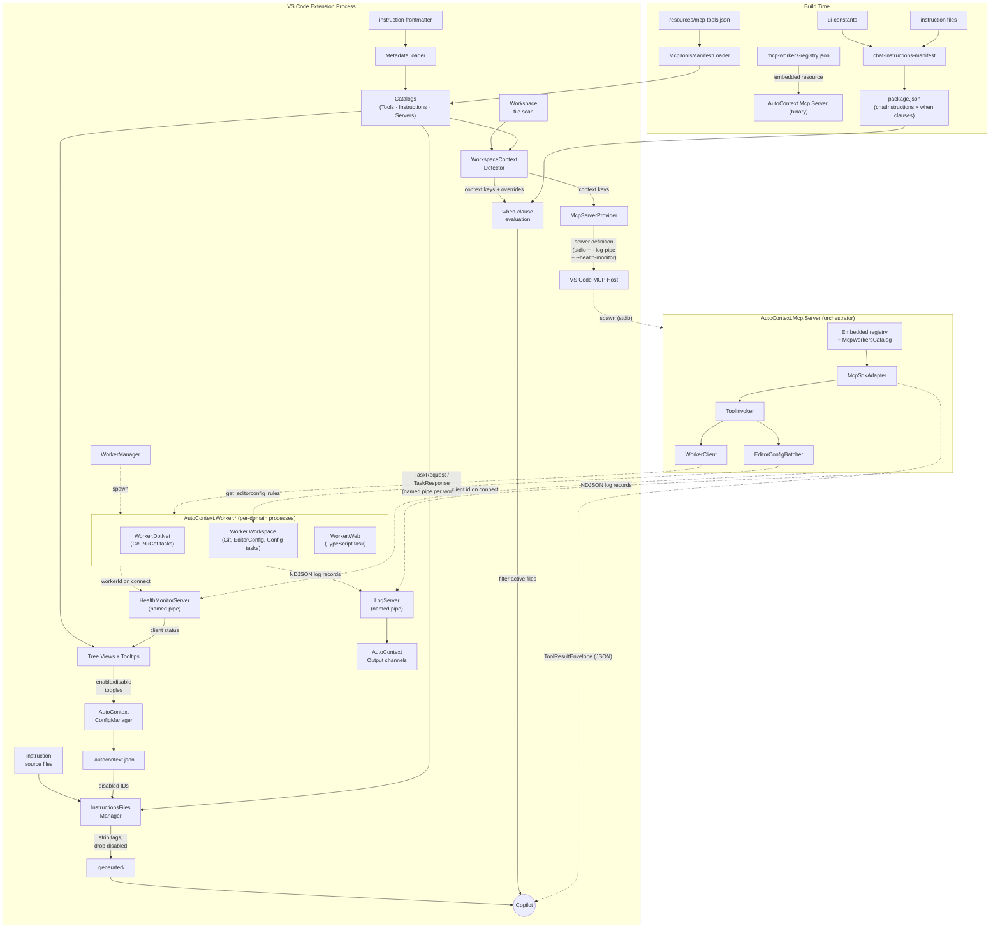

# Architecture

## What Is AutoContext?

AutoContext is a **context toolkit for AI coding assistants**. It ships with curated instructions that shape how code is written and reviewed, bundled MCP tools that validate code against concrete rules, and a context orchestration layer that automatically wires the right guidance and checks into the model based on the workspace and environment.

## Design Philosophy

### Why Instructions + Tools?

Instructions alone give guidance but can't verify compliance. Tools alone can flag violations but without context they produce generic advice. Combining both means Copilot receives coding guidelines (instructions) and can then verify its own output against those guidelines (tools) — a feedback loop that catches mistakes before they leave the chat.

### Why EditorConfig-Driven Enforcement?

Style rules vary between projects. Rather than hardcoding one opinion, checkers read `.editorconfig` properties and enforce whichever direction the project specifies. If a project uses tabs, the checker enforces tabs. If it uses spaces, it enforces spaces. Instructions provide sensible defaults, but EditorConfig always wins — so a team's existing configuration is never contradicted.

### Why an Orchestrator + Workers?

Copilot sees a single MCP server (`AutoContext.Mcp.Server`) that exposes every tool. Behind it, each tool is implemented as one or more **MCP Tasks** owned by a domain-specific worker process: `.NET` tasks live in `AutoContext.Worker.DotNet`, workspace tasks (Git, EditorConfig, `.autocontext.json`) live in `AutoContext.Worker.Workspace`, and TypeScript tasks live in `AutoContext.Worker.Web` (Node.js). The orchestrator embeds a registry that names every tool, its parameters, its tasks, and the worker that owns each task — and dispatches each call over a named pipe.

This buys three things: (1) a stable, consolidated MCP surface for the client even as workers come and go; (2) language affinity — `.NET` analyzers run in .NET, the TypeScript analyzer runs in Node.js; (3) cheap, parallel sub-task fan-out — every task in a tool runs concurrently against its worker.

### Why Per-Instruction Disable?

A single instruction file may contain dozens of rules. Turning off the entire file because one rule conflicts with a project convention defeats the purpose. Per-instruction disable (via `.autocontext.json`) removes individual bullets from the normalized output so Copilot never sees them — without affecting the rest of the file.

---

## How It All Connects

AutoContext spans **five OS processes** at runtime when running inside VS Code, fed by **two manifests**: an embedded **workers registry** that drives orchestrator dispatch, and an extension-side **MCP tools manifest** that drives sidebar UI. The diagram shows what produces what, how data flows between components, and which messages cross process boundaries.

The diagram reads top-to-bottom: **build artifacts** feed into the **extension process**, which spawns and configures every `AutoContext.Worker.*` process directly (`WorkerManager`) and registers the MCP definition that VS Code's MCP host uses to spawn `AutoContext.Mcp.Server`. Dotted lines cross process boundaries. Key connections to follow:

- **`AutoContext.Mcp.Server`** is the only MCP/stdio server Copilot ever talks to. At startup it deserializes its **embedded `mcp-workers-registry.json`** into `McpWorkersCatalog` (per-tool name, parameters, tasks, owning worker id) and registers every tool with the MCP SDK via `McpSdkAdapter`.
- **`ToolInvoker`** orchestrates one `tools/call`: it (a) computes the union of EditorConfig keys across the tool's tasks, (b) batches a single `get_editorconfig_rules` pipe call to `Worker.Workspace` via `EditorConfigBatcher`, (c) dispatches every task in parallel via `WorkerClient`, and (d) composes the per-task responses into a uniform `ToolResultEnvelope` via `ToolResultComposer`.
- **`WorkerClient`** opens one `NamedPipeClientStream` per task to `autocontext.worker-<id>` (with a per-window suffix), writes a `TaskRequest`, and reads a `TaskResponse`. A 30-second wait deadline guards against hung workers; any IO/timeout/parse failure is mapped to a synthesized error response so partial results still flow back to Copilot.
- **`WorkerManager`** (extension-side) spawns each worker listed in `resources/servers.json` whose id is referenced by an enabled tool, passes `--log-pipe` and `--health-monitor` pipe names, and waits for each worker's `Ready.` stderr marker before considering it live.
- **Catalogs** are the central UI hub — built from `resources/mcp-tools.json` + `MetadataLoader` output, they feed into tree views, the workspace context detector, the server provider, and the instructions writer.
- **`WorkspaceContextDetector`** scans workspace files and sets context keys, which drive MCP server registration (`McpServerProvider`), instruction filtering (`when`-clause evaluation against `chatInstructions` in `package.json`), and tree views (detected state + override file versions for staleness comparison).
- **`.autocontext.json`** is the single source of truth for user configuration. `AutoContextConfigManager` reads and writes tool on/off toggles, disabled instruction IDs, and per-instruction disable lists. The orchestrator does not read this file — `McpServerProvider` advertises the entire MCP server only when **at least one** tool is enabled (otherwise it returns no server definitions); per-tool toggle state is projected to VS Code context keys by `ConfigContextProjector` so the sidebar UI and instruction `when` clauses can react.
- **`.generated/`** files are what Copilot actually reads — they are the instruction source files with `[INSTxxxx]` tags stripped and disabled rules removed. VS Code's `when`-clause engine evaluates the context keys to decide which `.generated/` files are active for a given workspace.
- **`HealthMonitorServer`** runs a named pipe that every spawned process connects to on startup. The connecting process sends its stable id (`mcp-server` for the orchestrator, `dotnet`/`workspace`/`web` for the workers); the extension tracks active connections per id and exposes running/stopped status on tree view server nodes.
- **`LogServer`** runs a separate named pipe that every spawned process connects to. Each connection emits a JSON greeting with its `clientName` (e.g. `AutoContext.Worker.DotNet`), then NDJSON log records carrying category, level, message, and an optional per-`tools/call` correlation id. Records are fanned out to per-worker `LogOutputChannel`s under the AutoContext Output panel.

The [Activation Flow](#activation-flow) section below describes the exact ordering and parallelism of the startup steps. The [Runtime Flow](#runtime-flow) section describes what happens when Copilot calls a tool.

---

## Activation Flow

When the extension activates, the following phases execute (see `src/AutoContext.VsCode/src/extension.ts`):

**Phase 1 — Manifests & catalogs** — `MetadataLoader` parses YAML frontmatter from every instruction file (description, version, optional `applyTo`) and probes for a sibling `.CHANGELOG.md` (recording `hasChangelog`). `McpToolsManifestLoader` loads `resources/mcp-tools.json`. `InstructionsFilesManifestLoader` and `ServersManifestLoader` build their manifests from disk. The results feed `InstructionsCatalog`, `McpToolsCatalog`, and `McpServersCatalog`, which serve as the single source of truth for downstream consumers (tree views, tooltips, the instruction writer, the server provider).

**Phase 2 — Pipe servers** — `LogServer.start()` creates a named pipe (`autocontext-log-<random>`); `HealthMonitorServer` is constructed (its pipe is created in Phase 4). Both pipe names are random and per-window, so multiple VS Code windows are fully isolated.

**Phase 3 — Worker manager & MCP provider** — `WorkerManager` is constructed with the LogServer + HealthMonitor pipe names. `McpServerProvider` is constructed with the same pipe names plus the manifests, so it can produce a `vscode.McpStdioServerDefinition` for `AutoContext.Mcp.Server` whenever VS Code asks. The provider is registered later in this phase (after detection) but the construction happens first because tree providers depend on it.

**Phase 4 — Start services** — `healthMonitor.start()` opens its named pipe and begins accepting client connections. `workerManager.start()` spawns each worker referenced by an enabled tool, passes `--log-pipe`, `--health-monitor`, and `--endpoint-suffix` arguments, and resolves each worker's "ready" promise when it sees the worker's `[<WorkerName>] Ready.` stderr marker.

**Phase 5 — Register MCP provider** — `vscode.lm.registerMcpServerDefinitionProvider('AutoContextProvider', mcpServerProvider)` is registered **before** workspace detection so tools appear in the picker immediately. The provider returns a `McpStdioServerDefinition` that points VS Code's MCP host at `AutoContext.Mcp.Server`'s binary (with `--log-pipe`, `--health-monitor`, and `--endpoint-suffix`). VS Code then spawns the orchestrator over stdio.

**Phase 6 — Workspace detection** — `WorkspaceContextDetector.detect()` scans the workspace for project files, `package.json` dependencies, and directory markers. Sets VS Code context keys that control both server registration and instruction injection. Also scans `.github/instructions/` for override files, parsing their frontmatter to extract version numbers for staleness comparison (see [Override Staleness](#override-staleness)).

**Phase 7 — Notify MCP host** — fires a change event so VS Code re-queries the MCP provider with the now-known context keys.

**Phase 8 — Workspace-ready barrier** — `await workerManager.whenWorkspaceReady()` (with a soft 30-second timeout) gates any config-dependent work on `Worker.Workspace` being up.

**Phase 9 (parallel)** — three operations run concurrently via `Promise.all()`:

- **`ConfigContextProjector.project()`** — projects config state to VS Code context keys for all instructions and tools.
- **`InstructionsFilesManager.removeOrphanedStagingDirs()`** — deletes per-workspace staging directories older than one hour that belong to other VS Code windows.
- **`AutoContextConfigManager.removeOrphanedIds()`** — cleans disabled-instruction IDs from `.autocontext.json` that no longer match any instruction in the current extension version.

**Phase 10 — Register commands & listeners** — registers all extension commands (auto-configure, toggle/reset/enable/disable instructions, export mode, delete override, show original, show changelog, show what's new, show/hide not detected, start/stop/restart/show-output MCP servers). Wires event listeners: config changes trigger diagnostic logging and MCP re-registration; window focus and workspace trust changes trigger instruction re-writing.

**Phase 11 — `clearStaleDisabledIds()`** — compares the MAJOR.MINOR version stored alongside each file's disabled instruction IDs in `.autocontext.json` against the current catalog version. If the file's version has advanced (rules may have been renumbered or removed), all disabled IDs for that file are cleared and the user is notified. Patch-only bumps are ignored because they preserve rule IDs. See [Versioning Semantics](#versioning-semantics) for the version-level contract.

**Phase 12 — `InstructionsFilesManager.write()`** — normalizes all instruction files into `instructions/.generated/`, stripping `[INSTxxxx]` tag identifiers and removing any individually disabled instruction bullets. Copilot always reads from the normalized output, so neither tags nor disabled content are visible to the model. Runs after Phases 9–11 because it depends on workspace detection, config state, and stale-ID clearing.

**Phase 13 — Extension upgrade detection** — compares the running extension version against `lastSeenVersion` in global state. If the version differs, a badge is set on the Instructions tree view (`"New version available"`) that auto-dismisses when the user next reveals the panel. The `HasWhatsNew` context key is also set if the extension ships a `CHANGELOG.md`, enabling the "Show What's New" command.

**Phase 14 — `logDiagnostics()`** — runs `InstructionsFilesDiagnosticsRunner` against every instruction file and logs warnings (e.g., missing `[INSTxxxx]` IDs) to the **AutoContext** Output channel.

## Runtime Flow

When Copilot invokes an MCP tool (e.g. `analyze_csharp_code`):

1. **Reception (orchestrator).** VS Code's MCP host forwards the `tools/call` request over stdio to `AutoContext.Mcp.Server`. The MCP SDK invokes the registered handler, which lives in `McpSdkAdapter`. The adapter mints an 8-character correlation id and resolves the matching `McpToolDefinition` from `McpWorkersCatalog`.
2. **Tool invocation.** `ToolInvoker.InvokeAsync()` walks the tool's tasks, computes the union of EditorConfig keys declared by those tasks, and — if any keys are required — issues a single batched `get_editorconfig_rules` pipe call to `AutoContext.Worker.Workspace` via `EditorConfigBatcher`. The result is sliced per-task: each task receives only the keys it asked for.
3. **Parallel task dispatch.** For each `McpTaskDefinition`, `ToolInvoker` calls `WorkerClient.InvokeAsync(endpoint, request, ct)`. All tasks in the tool run **concurrently** via `Task.WhenAll(...)`. The endpoint is `autocontext.worker-<workerId>` (with the per-window suffix); the request is a `TaskRequest` carrying the task name, the caller's input data, the EditorConfig slice for that task, and the correlation id.
4. **Worker execution.** The worker process — `Worker.DotNet`, `Worker.Workspace`, or `Worker.Web` — accepts the connection, deserializes the `TaskRequest`, looks up the matching `IMcpTask` implementation (registered as a singleton via `WorkerHostBuilderExtensions.ConfigureWorkerHost`), and runs it under a `CorrelationScope` so every log record carries the same correlation id. The worker writes back a `TaskResponse` with `status: "ok" | "error"`, an `output` payload, and an optional `error` string.
5. **Result composition.** `ToolResultComposer.Compose(toolName, entries, elapsedMs)` rolls every per-task `TaskResponse` into a uniform `ToolResultEnvelope` whose entries match the **declared** task order (not completion order). The status field summarizes the run: `ok` (all succeeded), `error` (all failed), or `partial` (mix). The envelope is serialized as JSON and returned to VS Code; VS Code forwards it to Copilot.

`WorkerClient` enforces a 30-second wait deadline and never throws for IO/timeout/parse failures. Any such failure becomes an `error`-status `TaskResponse` for that one task, so the rest of the tool's tasks still complete and Copilot sees a partial-but-actionable result.

---

## Health Monitoring

Each spawned process — the orchestrator and every worker — connects to the extension's `HealthMonitorServer` on startup via a named pipe (`autocontext-health-<random>`). The protocol is intentionally minimal:

1. The extension creates a `net.createServer()` listening on the health pipe.
2. Each process connects and writes its **stable id** as the first and only data message:
   - `mcp-server` for `AutoContext.Mcp.Server` (declared as `Program.HealthClientId`).
   - `dotnet`, `workspace`, `web` for the workers (declared as `Program.WorkerId` in each).
3. The connection is kept alive for the lifetime of the process. When the process exits, the OS closes the socket and the extension detects disconnect.

The extension tracks active connections per id and exposes `isRunning(id)` (true if at least one socket is open for that id). The `McpToolsTreeProvider` maps that result onto each server node's status in the sidebar:

| Status | Shown When |
|--------|------------|
| **Running** | At least one client with the matching id is connected. |
| **Stopped** | No client with that id is connected. |

Inline actions on server nodes allow the user to **Start**, **Stop**, **Restart**, or **Show Output** for each server directly from the sidebar. These commands delegate to VS Code's built-in `workbench.mcp.startServer`, `workbench.mcp.stopServer`, `workbench.mcp.restartServer`, and `workbench.mcp.showOutput` commands.

On the .NET side, `HealthMonitorClient` lives in `AutoContext.Framework/Hosting` and is consumed by both the orchestrator and every worker (registered as a hosted service in each `Program.Main`). Connection failures are non-fatal — health monitoring is a best-effort diagnostic, not a prerequisite for tool operation. Workers also write a `Ready.` marker to stderr — the orchestrator emits it from its own `Hosting/ReadyMarkerService`, while workers emit it from inside `WorkerTaskDispatcherService` once the pipe server is accepting connections — and `WorkerManager` uses the marker for its `whenReady()` barrier (independent of the health pipe).

---

## Incremental Workspace Detection

After the initial full scan (`detect()`), `WorkspaceContextDetector` uses three file-system watchers to maintain detection state incrementally:

- **Existence watcher** — watches for creation/deletion of source files by extension (e.g., `.ts`, `.cs`, `.razor`).
- **Content watcher** — watches project manifests (`package.json`, `*.csproj`, etc.) for content changes that may add or remove framework dependencies.
- **Override watcher** — watches `.github/instructions/*.instructions.md` for user overrides.

When a watcher fires, the detector performs a targeted re-scan with 500ms debouncing:

- Only re-globs flags affected by deletions.
- Only re-scans npm or .NET content when their manifests change.
- Re-uses cached base flags for unchanged categories.
- Falls back to a full `detect()` if no prior scan exists.

Window focus changes also trigger an `InstructionsFilesManager.write()` to ensure normalized instruction files are up to date when the user returns to a window.

---

## Precedence

When multiple sources disagree, the following precedence applies:

| Priority | Source | Role |
|----------|--------|------|
| 1 | `.editorconfig` | Drives enforcement direction — tasks enforce whatever EditorConfig says. Instruction defaults yield to EditorConfig values. |
| 2 | Instruction files | Provide default coding guidance. Style rules in instructions are fallback defaults, not absolutes. |
| 3 | `.autocontext.json` | Controls which tools and instructions are active. |
| 4 | Workspace context | Determines which servers, tools, and instructions are advertised at all. |

See the "EditorConfig wins" rule in `copilot.instructions.md` for the user-facing statement of this precedence.

### Resolved Per Tool Call

EditorConfig values are pulled fresh on every `tools/call` (one batched pipe round-trip per invocation), so changes to `.editorconfig` take effect immediately — no extension reload required. Each task in the registry declares the keys it consumes; `ToolInvoker` unions them, asks `Worker.Workspace` for resolved values, and slices the response per task. A task with no declared keys gets an empty slice and runs against its instruction-only defaults.

Tasks that consume EditorConfig keys today (declared in `mcp-workers-registry.json`):

| Task | EditorConfig Keys |
|------|-------------------|
| `analyze_csharp_coding_style` | `csharp_prefer_braces`, `dotnet_sort_system_directives_first`, `csharp_style_expression_bodied_methods`, `csharp_style_expression_bodied_properties` |
| `analyze_csharp_project_structure` | `csharp_style_namespace_declarations` |

---

## Instructions

AutoContext ships curated Markdown instruction files organized into categories — General, Languages, .NET, Web, and Tools. The full list is defined in `ui-constants.ts`. One always-on file (`copilot.instructions.md`) provides cross-cutting rules; the rest are toggleable.

Each instruction file carries YAML frontmatter with a `name` (including an optional `(vX.Y.Z)` version suffix), `description`, and optional `applyTo` glob. `MetadataLoader` extracts this frontmatter at activation time (see [Activation Flow](#activation-flow) Phase 1), and the metadata is surfaced as rich tooltips in the sidebar panel.

Instructions are **workspace-aware** — they are only injected into Copilot's context when the workspace contains their technology (e.g., .NET instructions require a `.csproj` or `.sln` file). The always-on `copilot.instructions.md` is the only file that is attached unconditionally.

### Toggling

The **Instructions** sidebar panel groups instructions by category and lets you enable or disable each one via inline actions. Toggling an instruction off writes the disabled state to `.autocontext.json`, and the activation flow excludes it from the normalized output.

### Per-Instruction Disable

Each instruction file can contain dozens of individual rules. Click an instruction in the sidebar panel to open it in a virtual document where every rule is visible. CodeLens actions on each rule let you disable or re-enable it without turning off the entire file. Disabled rules are dimmed, tagged `[DISABLED]`, and written to `.autocontext.json`. The normalization step strips them from Copilot's context entirely.

### Export

Enter export mode from the Instructions panel header icon, check the instructions you want to export, and confirm. Files are copied to `.github/instructions/` for team sharing via source control. Exported instructions appear as **overridden** in the panel — the workspace-level file takes precedence over the built-in version. Delete the exported file to revert to the built-in version.

### Override Staleness

When an overridden instruction exists in `.github/instructions/`, `WorkspaceContextDetector` parses its frontmatter during workspace detection and extracts the version number. The tree view compares this override version against the bundled catalog version using `SemVer.isGreaterThan()`:

- **Not outdated** — the override version is equal to or greater than the bundled version. The tree item shows `"overridden"` with a standard tooltip.
- **Outdated** — the bundled version is newer. The tree item shows `"overridden (outdated)"` with a tooltip explaining that a newer version is available. Deleting the override shows a modal warning that includes both version numbers and confirms the user wants to upgrade to the latest built-in version.

Instructions with no version in their frontmatter are treated as non-outdated — there is no version to compare.

Inline actions on overridden items include **Show Original** (opens the bundled version in a virtual document for side-by-side comparison) and, when a `.CHANGELOG.md` companion file exists, **Show Changelog** (opens the version history in Markdown preview).

### Normalization Pipeline

Copilot never reads the raw instruction files. Three directories form a write-through pipeline:

- **`instructions/`** — the authored source files. Each rule is tagged with an `[INSTxxxx]` identifier used for per-rule disable and CodeLens UI. These files are never served to Copilot directly.
- **`instructions/.workspaces/<hash>/`** — per-workspace staging. Each VS Code window writes its own normalized copy here, keyed by a SHA-256 hash of the workspace root path. Normalization strips `[INSTxxxx]` tags and removes disabled rules entirely. The staging layer exists because multiple VS Code windows share a single extension directory — without it, windows with different configurations would overwrite each other's output. Orphaned staging directories (from closed windows, older than one hour) are garbage-collected on activation.
- **`instructions/.generated/`** — the live output that Copilot's `chatInstructions` reads. After staging, files are promoted here with a content-comparison guard (`copyIfChanged`) so identical content is never rewritten. Each file has a `when` clause that combines the instruction's context key (projected from `.autocontext.json` by `ConfigContextProjector`) and the workspace context key — Copilot only sees files relevant to the current workspace.

On activation (and on configuration or window-focus changes), `InstructionsFilesManager.write()` runs the full source → staging → promotion cycle. Content-comparison guards at both stages make re-runs essentially free when nothing changed.

> **Future:** The three-directory pipeline exists because VS Code's `chatInstructions` contribution point is static — it can only reference files on disk. If the `chatPromptFiles` proposed API graduates to stable, `registerInstructionsProvider()` could serve normalized instruction content in-memory, eliminating the staging and generated directories entirely. Each window would provide its own content dynamically with no multi-window file conflicts. See [docs/future/dynamic-editorconfig-instructions.md](future/dynamic-editorconfig-instructions.md) for the current status of that API.

---

## Upgrade Detection

AutoContext tracks version changes at two levels — the extension as a whole, and each individual instruction — so users are aware of new content without being interrupted.

### Extension Upgrade Badge

On activation, the extension compares its running version against `lastSeenVersion` stored in VS Code global state. When they differ (the extension was just updated), a numeric badge appears on the **Instructions** tree view with a `"New version available"` tooltip. The badge auto-dismisses the next time the user reveals the panel, at which point `lastSeenVersion` is updated to the current version. If the extension ships a `CHANGELOG.md`, the **Show What's New** command is available from the panel header menu, opening the release notes in Markdown preview.

### Stale Disabled-ID Clearing

When an instruction's MAJOR.MINOR version advances, its `[INSTxxxx]` IDs may no longer map to the same rules. On activation, `clearStaleDisabledIds()` compares the MAJOR.MINOR stored in `.autocontext.json` against each instruction's current catalog version. If the version has advanced, all disabled IDs for that file are removed and the user sees an information message naming the affected files. Patch-only bumps preserve disabled IDs because the rule set is unchanged. See [Versioning Semantics](#versioning-semantics) for the full version-level contract.

### Per-Instruction Changelogs

Instruction files can ship with a companion `.CHANGELOG.md` (e.g., `lang-csharp.CHANGELOG.md`). `MetadataLoader` checks for this file at activation and records `hasChangelog` on the catalog entry. When present, a **Show Changelog** inline action appears on the tree item, opening the version history in Markdown preview so users can see what changed between versions.

---

## Metadata & Manifests

AutoContext is driven by **two separate manifests**, each owned by a different process and serving a different purpose. Both must agree on tool/task names — the build copies and validates them in lockstep.

### `mcp-workers-registry.json` (orchestrator)

`src/AutoContext.Mcp.Server/mcp-workers-registry.json` is **embedded as a resource** in the orchestrator binary. At startup, `RegistryEmbeddedResource` reads it from the assembly, `RegistryLoader.Parse` deserializes it into `McpWorkersCatalog`, and `RegistrySchemeValidator` validates structure against `mcp-workers-registry.schema.json` (also embedded). Each entry declares a worker's `id` plus the tools it owns, each tool's input parameters (used by `InputSchemaBuilder` to build the JSON Schema advertised to the MCP client), and each tool's tasks (with optional `editorconfig` keys for the EditorConfig batcher).

This manifest is the **single source of truth for orchestrator dispatch** — no other file affects which tool calls go to which worker.

### `resources/mcp-tools.json` (extension UI)

`src/AutoContext.VsCode/resources/mcp-tools.json` is loaded by `McpToolsManifestLoader` on extension activation. It carries the same tool/task names plus extension-only UI metadata: category grouping (`.NET`, `Workspace`, `Web`, `C#`, `NuGet`, `TypeScript`, `Git`, `EditorConfig`), `activationFlags` (e.g. `hasDotNet`), per-tool descriptions surfaced in tree-view tooltips, and the `workerId` that maps a category to the spawned worker.

### Instruction Frontmatter

Each instruction file carries YAML frontmatter (`name`, `description`, optional `applyTo`). The version is embedded as a suffix in the `name` field — e.g., `name: "lang-csharp (v1.0.0)"`. `MetadataLoader` extracts it via `SemVer.fromParentheses()` and merges the result into `InstructionsCatalog`.

### Versioning Semantics

Both instructions and tools carry semver version strings. The version levels have specific meanings:

**Instructions:**

| Level | Meaning | Impact on disabled IDs |
|-------|---------|----------------------|
| Major | Complete replacement — rules renumbered, removed, or fundamentally changed. `[INSTxxxx]` IDs from the previous major are not comparable. | Clear all disabled IDs |
| Minor | Rule set changed — IDs added, removed, or reordered. An existing `[INSTxxxx]` may now point to a different rule. | Clear all disabled IDs |
| Patch | Wording refined — same rules, same IDs, same order. No behavioral change. | Keep disabled IDs as-is |

When an instruction's MAJOR.MINOR version advances beyond the version stored alongside the user's disabled IDs, those IDs are automatically cleared and the user is notified. Patch-only bumps silently update the stored version.

**Tools:**

| Level | Meaning |
|-------|---------|
| Major | Breaking — tools or tasks renamed, removed, or fundamentally changed |
| Minor | New tools or tasks added; existing surface unchanged |
| Patch | Bug fixes or refinements to existing tasks |

---

## MCP and Tools

AutoContext exposes a single MCP/stdio server, `AutoContext.Mcp.Server`, that fronts every tool. Each tool is one or more **MCP Tasks** owned by a single worker process; the orchestrator dispatches per-task pipe calls in parallel. Tool, task, category, and worker mappings are all defined in `mcp-workers-registry.json` (orchestrator-side) and `resources/mcp-tools.json` (extension-side UI).

Today's tool surface (one composite tool per category, plus tasks):

| Category | Tool | Owning Worker |
|----------|------|----------------|
| .NET / C# | `analyze_csharp_code` (7 tasks: async, coding-style, member-ordering, naming, nullable, project-structure, test-style) | `Worker.DotNet` |
| .NET / NuGet | `analyze_nuget_references` (1 task: hygiene) | `Worker.DotNet` |
| Workspace / Git | `analyze_git_commit_message` (2 tasks: format, content) | `Worker.Workspace` |
| Workspace / EditorConfig | `read_editorconfig` (1 task: `get_editorconfig_rules`) | `Worker.Workspace` |
| Web / TypeScript | `analyze_typescript_code` (1 task: coding-style) | `Worker.Web` |

### Projects

The .NET solution and one Node.js workspace make up the runtime side:

- **`AutoContext.Mcp.Abstractions`** — `IMcpTask` interface only. The contract every worker task implements; depended on by both the workers and (transitively) the orchestrator's registry.
- **`AutoContext.Framework`** — Cross-cutting framework primitives shared by every .NET process:
  - `Hosting/` — `HealthMonitorClient` (the hosted service that connects to the extension's HealthMonitorServer pipe and announces this process's stable id; a no-op when `--health-monitor` was not supplied).
  - `Logging/` — `LoggingClient`, `PipeLoggerProvider`, `PipeLogger`, `JsonLogGreeting`/`JsonLogEntry`, `CorrelationScope` (the per-`tools/call` ambient correlation id).
  - `Workers/` — `WorkerProtocolChannel` (the pipe-framing helper used by both the orchestrator's `WorkerClient` and the workers' dispatcher), `WorkerHostOptions`, `WorkerTaskDispatcherService` (the worker-side hosted service that accepts pipe connections, routes each `TaskRequest` to the matching `IMcpTask`, and emits the worker's `Ready.` stderr marker once it's listening).
- **`AutoContext.Worker.Shared`** — `Hosting/WorkerHostBuilderExtensions.ConfigureWorkerHost(args, readyMarker, workerId, ...)`. The single helper every worker calls in `Program.Main` to wire logging (`--log-pipe`), health monitoring (`--health-monitor`), endpoint suffix (`--endpoint-suffix`), and the dispatcher pipe.
- **`AutoContext.Mcp.Server`** — The MCP/stdio orchestrator. One process, one binary, one tool surface:
  - `Registry/` — Embedded-resource loader, schema validator, strongly typed catalog (`McpWorkersCatalog`, `McpWorker`, `McpToolDefinition`, `McpTaskDefinition`, `McpToolParameter`), and `InputSchemaBuilder` (turns parameter declarations into the JSON Schema sent to the MCP client).
  - `Tools/` — `McpSdkAdapter` (the bridge to the official ModelContextProtocol SDK), `Invocation/` (`ToolDelegateFactory`, `ToolHandler`, `ToolInvoker`), and `Results/` (`ToolResultEnvelope`, `ToolResultEntry`, `ToolResultSummary`, `ToolResultError`, `ToolResultComposer`).
  - `Workers/` — `WorkerClient` (one pipe round-trip per task; 30 s deadline; never throws on IO/timeout/parse failure), `Protocol/` (`TaskRequest`, `TaskResponse`, `WorkerJsonOptions`), `Transport/` (`EndpointFormatter`, `EndpointOptions`).
  - `EditorConfig/` — `EditorConfigBatcher` (one pipe call per `tools/call` to `Worker.Workspace`'s `get_editorconfig_rules` task; results are sliced per task).
  - `Hosting/` — `ReadyMarkerService` (writes the `Ready.` stderr marker via `IHostedLifecycleService.StartedAsync` so the parent process can detect that the orchestrator has finished startup).
- **`AutoContext.Worker.DotNet`** — .NET worker. Owns the `analyze_csharp_*` and `analyze_nuget_*` tasks (`Tasks/CSharp/` and `Tasks/NuGet/`). `Program.Main` registers each task as a singleton `IMcpTask` and starts `WorkerTaskDispatcherService`.
- **`AutoContext.Worker.Workspace`** — .NET worker. Owns the `analyze_git_*`, `get_editorconfig_rules`, and `get_autocontext_config_file` tasks (`Tasks/Git/`, `Tasks/EditorConfig/`, `Tasks/Config/`). `Hosting/WorkerOptions.WorkspaceRoot` is the per-window workspace root passed via `--workspace-root`.
- **`AutoContext.Worker.Web`** — Node.js / TypeScript worker. Owns the `analyze_typescript_coding_style` task. Mirrors the .NET worker structure with TypeScript equivalents of `LoggingClient`, `HealthMonitorClient`, and the dispatcher loop.

### EditorConfig Resolution

`.editorconfig` resolution lives in **one place**: `AutoContext.Worker.Workspace`'s `GetEditorConfigRulesTask`. Two paths reach it:

| Caller | Path | Purpose |
|--------|------|---------|
| Copilot (directly) | `read_editorconfig` MCP tool → orchestrator → pipe → `GetEditorConfigRulesTask` | Lets the model ask "what `.editorconfig` rules apply to this file?" before generating code. |
| Orchestrator (internally) | `ToolInvoker` → `EditorConfigBatcher.ResolveAsync` → pipe → `GetEditorConfigRulesTask` | Runs once per `tools/call` to gather every key declared by the tool's tasks in one round-trip. |

There is no shared in-process resolver and no `IEditorConfigFilter` abstraction — the orchestrator treats EditorConfig as just another worker capability. This keeps `Worker.Workspace` as the single owner of EditorConfig parsing and section cascading, and means the same code paths serve both Copilot calls and internal batching.

### Viewing Tool Invocation Logs

Every `AutoContext.Worker.*` and `AutoContext.Mcp.Server` process connects to the extension-hosted `LogServer` over its dedicated named pipe, sending one greeting line followed by NDJSON log records. The extension routes records to per-process `LogOutputChannel`s under the **AutoContext** Output panel:

1. Open the **Output** panel (`Ctrl+Shift+U`).
2. Select **AutoContext: \<process name\>** from the dropdown — e.g. `AutoContext: AutoContext.Worker.DotNet`, `AutoContext: AutoContext.Mcp.Server`.

Every record carries a `category` (the .NET `ILogger` category), a `level` (`Trace`/`Debug`/`Information`/`Warning`/`Error`/`Critical`), a `message`, an optional `exception`, and — for records emitted inside a `tools/call` — a short `correlationId` minted by `McpSdkAdapter`. The same correlation id appears in records from the orchestrator and every worker that participated, so a single tool call is traceable end-to-end.

If the LogServer pipe is unavailable (e.g. running a worker standalone outside VS Code), `LoggingClient` falls back to writing each record to stderr; `WorkerManager`'s stderr line-handler still surfaces those lines, just under its own subcategory rather than a per-worker channel.

---

*This document provides an architectural overview. For build instructions and configuration, see the [README](../README.md).*
