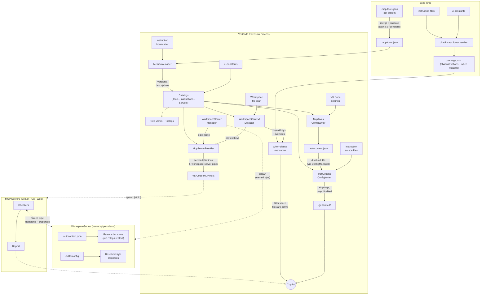

# Architecture

## What Is AutoContext?

AutoContext is a **context toolkit for AI coding assistants**. It ships with curated instructions that shape how code is written and reviewed, bundled MCP tools that validate code against concrete rules, and a context orchestration layer that automatically wires the right guidance and checks into the model based on the workspace and environment.

## Design Philosophy

### Why Instructions + Tools?

Instructions alone give guidance but can't verify compliance. Tools alone can flag violations but without context they produce generic advice. Combining both means Copilot receives coding guidelines (instructions) and can then verify its own output against those guidelines (tools) — a feedback loop that catches mistakes before they leave the chat.

### Why EditorConfig-Driven Enforcement?

Style rules vary between projects. Rather than hardcoding one opinion, checkers read `.editorconfig` properties and enforce whichever direction the project specifies. If a project uses tabs, the checker enforces tabs. If it uses spaces, it enforces spaces. Instructions provide sensible defaults, but EditorConfig always wins — so a team's existing configuration is never contradicted.

### Why a Separate Workspace Server?

Other MCP servers need `.editorconfig` properties and tool enable/disable decisions, but reparsing the directory tree and config file on every tool call would be wasteful and error-prone. `AutoContext.WorkspaceServer` centralizes these concerns in a single long-lived process so the checkers stay stateless. The same binary also hosts technology-agnostic MCP tools directly — see [Projects](#projects) for the full mode breakdown.

### Why Per-Instruction Disable?

A single instruction file may contain dozens of rules. Turning off the entire file because one rule conflicts with a project convention defeats the purpose. Per-instruction disable (via `.autocontext.json`) removes individual bullets from the normalized output so Copilot never sees them — without affecting the rest of the file.

---

## How It All Connects

AutoContext spans **three OS processes** at runtime, fed by **two build-time manifests**. The diagram shows what produces what, how data flows between components, and which files cross process boundaries.

The diagram reads top-to-bottom: **build artifacts** feed into the **extension process**, which spawns and configures the **WorkspaceServer sidecar** and **MCP servers**. Dotted lines cross process boundaries. Key connections to follow:

- **Catalogs** are the central hub — built from `ui-constants` + `MetadataLoader` output, they feed into tree views, config writers, the detector, and the server provider.
- **WorkspaceContextDetector** scans workspace files and sets context keys, which drive both MCP server registration (`McpServerProvider`) and instruction filtering (`when`-clause evaluation against `chatInstructions` in `package.json`).
- **`.autocontext.json`** bridges the extension and WorkspaceServer. The extension writes tool on/off toggles and disabled instruction IDs; WorkspaceServer reads them for per-feature run/skip/restrict decisions. MCP servers are separate OS processes and cannot read VS Code settings — this file is how toggle state crosses the process boundary.
- **`.generated/`** files are what Copilot actually reads — they are the instruction source files with `[INSTxxxx]` tags stripped and disabled rules removed. VS Code's `when`-clause engine evaluates the context keys to decide which `.generated/` files are active for a given workspace.
- **MCP servers** connect to the WorkspaceServer sidecar over a named pipe to get feature decisions and resolved `.editorconfig` properties, then run their checkers and return reports to Copilot.

The [Activation Flow](#activation-flow) section below describes the exact ordering and parallelism of the startup steps. The [Runtime Flow](#runtime-flow) section describes what happens when Copilot calls a tool.

---

## Activation Flow

When the extension activates, the following steps execute:

**Phase 1 — Metadata & Catalogs** — `MetadataLoader` reads the merged `.mcp-tools.json` manifest (tool name, description, version) and parses YAML frontmatter from every instruction file (description, version). The results are passed to `McpToolsCatalog`, `InstructionsCatalog`, and `McpServersCatalog`, which enrich the raw `ui-constants` data with metadata and serve as the single source of truth for all downstream consumers (tree views, tooltips, config writers, server provider).

**Phase 2 — `WorkspaceServerManager.start()`** — spawns `AutoContext.WorkspaceServer` in named-pipe mode (see [Projects](#projects)). Each VS Code window gets its own pipe (`autocontext-workspace-<random>`) and its own server process, so multiple windows are fully isolated. The pipe name is injected into every MCP server definition via `--workspace-server`.

**Phase 3 (parallel)** — the following four operations run concurrently via `Promise.all()`:

- **`WorkspaceContextDetector.detect()`** — scans the workspace for project files, `package.json` dependencies, and directory markers. Sets VS Code context keys that control both server registration and instruction injection.
- **`McpToolsConfigWriter.write()`** — persists the user's tool on/off toggles from VS Code settings into `.autocontext.json`. MCP servers are separate processes that cannot access VS Code settings, so `.autocontext.json` is how the WorkspaceServer knows which features to run, skip, or restrict at runtime.
- **`InstructionsConfigWriter.removeOrphanedStagingDirs()`** — deletes per-workspace staging directories older than one hour that belong to other VS Code windows.
- **`ConfigManager.removeOrphanedIds()`** — cleans disabled-instruction IDs from `.autocontext.json` that no longer match any instruction in the current extension version.

**Phase 4 — `InstructionsConfigWriter.write()`** — normalizes all instruction files into `instructions/.generated/`, stripping `[INSTxxxx]` tag identifiers and removing any individually disabled instruction bullets. Copilot always reads from the normalized output, so neither tags nor disabled content are visible to the model. Runs after phase 3 completes because it depends on workspace detection and config state.

**Phase 5 — `logDiagnostics()`** — parses every instruction file and logs warnings (e.g., missing `[INSTxxxx]` IDs) to the **AutoContext** Output channel.

## Runtime Flow

When Copilot invokes an MCP tool (e.g., `check_csharp_all`):

1. The MCP tool builds a list of its features — each entry includes the feature name and, for checkers that implement `IEditorConfigFilter`, the EditorConfig keys it consumes.
2. It sends a single `mcp-tools` request over the named pipe to `AutoContext.WorkspaceServer`, which reads `.autocontext.json` for tool status, resolves `.editorconfig` properties, and returns a per-feature decision:
   - **`run`** — feature is enabled; includes resolved EditorConfig data.
   - **`editorconfig-only`** — feature is disabled but has EditorConfig keys; run in restricted mode that enforces only EditorConfig-backed rules and skips instruction-only (INST) checks. This lets project-level `.editorconfig` settings remain enforced even after a team opts out of the instruction.
   - **`skip`** — feature is disabled and has no EditorConfig keys; skip entirely.
3. The MCP tool loops over features and acts on the mode. Enabled features use the merged EditorConfig values to **drive** their enforcement direction — not just to skip conflicting checks.
4. The checker returns a report (✅ pass or ❌ violations found).

MCP servers never read `.autocontext.json` directly — all tool orchestration decisions are centralized in WorkspaceServer so the config format and decision logic can evolve in one place.

---

## Precedence

When multiple sources disagree, the following precedence applies:

| Priority | Source | Role |
|----------|--------|------|
| 1 | `.editorconfig` | Drives enforcement direction — checkers enforce whatever EditorConfig says. Instruction defaults yield to EditorConfig values. |
| 2 | Instruction files | Provide default coding guidance. Style rules in instructions are fallback defaults, not absolutes. |
| 3 | VS Code settings / `.autocontext.json` | Control which tools and instructions are active. |
| 4 | Workspace context | Determines which servers and instructions are registered at all. |

See the "EditorConfig wins" rule in `copilot.instructions.md` for the user-facing statement of this precedence.

### EditorConfig as a Floor

Disabling a tool removes its **instruction-only** checks from the report, but project-level `.editorconfig` settings are a stronger signal than a personal tool toggle. Checkers that implement `IEditorConfigFilter` declare which EditorConfig keys they consume. When a checker is disabled but the resolved `.editorconfig` contains at least one of those keys, the checker runs in a restricted mode that enforces only the EditorConfig-backed rules and skips the instruction-only (INST) checks.

This means a team can commit a `.editorconfig` that requires file-scoped namespaces or braces on single-line blocks, and those checks remain enforced even if an individual developer disables the corresponding tool. The `.editorconfig` acts as a floor that cannot be silenced by local tool toggles.

Checkers with EditorConfig backing today:

| Checker | EditorConfig Keys |
|---------|-------------------|
| `check_csharp_coding_style` | `csharp_prefer_braces`, `dotnet_sort_system_directives_first`, `csharp_style_expression_bodied_methods`, `csharp_style_expression_bodied_properties` |
| `check_csharp_project_structure` | `csharp_style_namespace_declarations` |

---

## Instructions

AutoContext ships curated Markdown instruction files organized into categories — General, Languages, .NET, Web, and Tools. The full list is defined in `ui-constants.ts`. One always-on file (`copilot.instructions.md`) provides cross-cutting rules; the rest are toggleable.

Each instruction file carries YAML frontmatter with a `name` (including an optional `(vX.Y.Z)` version suffix), `description`, and optional `applyTo` glob. `InstructionsParser` extracts this frontmatter at activation time (see [Activation Flow](#activation-flow) Phase 1), and the metadata is surfaced as rich tooltips in the sidebar panel.

Instructions are **workspace-aware** — they are only injected into Copilot's context when the workspace contains their technology (e.g., .NET instructions require a `.csproj` or `.sln` file). The always-on `copilot.instructions.md` is the only file that is attached unconditionally.

### Toggling

The **Instructions** sidebar panel groups instructions by category and lets you enable or disable each one via inline actions. Toggling an instruction off sets its VS Code setting (e.g., `autocontext.instructions.dotnet.csharp`) to `false`, and the activation flow excludes it from the normalized output.

### Per-Instruction Disable

Each instruction file can contain dozens of individual rules. Click an instruction in the sidebar panel to open it in a virtual document where every rule is visible. CodeLens actions on each rule let you disable or re-enable it without turning off the entire file. Disabled rules are dimmed, tagged `[DISABLED]`, and written to `.autocontext.json`. The normalization step strips them from Copilot's context entirely.

### Export

Enter export mode from the Instructions panel header icon, check the instructions you want to export, and confirm. Files are copied to `.github/instructions/` for team sharing via source control. Exported instructions appear as **overridden** in the panel — the workspace-level file takes precedence over the built-in version. Delete the exported file to revert to the built-in version.

### Normalization Pipeline

Copilot never reads the raw instruction files. Three directories form a write-through pipeline:

- **`instructions/`** — the authored source files. Each rule is tagged with an `[INSTxxxx]` identifier used for per-rule disable and CodeLens UI. These files are never served to Copilot directly.
- **`instructions/.workspaces/<hash>/`** — per-workspace staging. Each VS Code window writes its own normalized copy here, keyed by a SHA-256 hash of the workspace root path. Normalization strips `[INSTxxxx]` tags and removes disabled rules entirely. The staging layer exists because multiple VS Code windows share a single extension directory — without it, windows with different configurations would overwrite each other's output. Orphaned staging directories (from closed windows, older than one hour) are garbage-collected on activation.
- **`instructions/.generated/`** — the live output that Copilot's `chatInstructions` reads. After staging, files are promoted here with a content-comparison guard (`copyIfChanged`) so identical content is never rewritten. Each file has a `when` clause that combines the instruction's VS Code setting toggle and the workspace context key — Copilot only sees files relevant to the current workspace.

On activation (and on configuration or window-focus changes), `InstructionsConfigWriter.write()` runs the full source → staging → promotion cycle. Content-comparison guards at both stages make re-runs essentially free when nothing changed.

> **Future:** The three-directory pipeline exists because VS Code's `chatInstructions` contribution point is static — it can only reference files on disk. If the `chatPromptFiles` proposed API graduates to stable, `registerInstructionsProvider()` could serve normalized instruction content in-memory, eliminating the staging and generated directories entirely. Each window would provide its own content dynamically with no multi-window file conflicts. See [docs/future/dynamic-editorconfig-instructions.md](future/dynamic-editorconfig-instructions.md) for the current status of that API.

---

## Metadata & Manifests

Tools and instructions carry version numbers and descriptions. This metadata flows from two sources into the extension at different times:

### Per-Project `.mcp-tools.json`

Each server project (`AutoContext.Mcp.DotNet`, `AutoContext.Mcp.Web`, `AutoContext.WorkspaceServer`) contains its own `.mcp-tools.json` declaring the tools it exposes. Each entry has a `name`, `description`, `version` (semver), and an optional `features` array for composite tools. During the build, `mcp-tools-manifest.ts` merges all per-project manifests into a single `.mcp-tools.json` at the extension root, validates that every leaf feature appears in `ui-constants.ts`, and checks that all versions are valid semver. Similarly, `chat-instructions-manifest.ts` builds the `chatInstructions` contribution in `package.json` from the instructions catalog.

### Instruction Frontmatter

Each instruction file carries YAML frontmatter (`name`, `description`, optional `applyTo`). The version is embedded as a suffix in the `name` field — e.g., `name: "lang-csharp (v1.0.0)"`. `InstructionsParser` extracts it via `SemVer.fromParentheses()`.

### MetadataLoader

At activation (Phase 1), `MetadataLoader` reads the merged `.mcp-tools.json` for tool metadata and parses frontmatter from every instruction file. The enriched data is passed to `McpToolsCatalog` and `InstructionsCatalog`, which serve as the single source of truth for tree views, tooltips, config writers, and the MCP server provider.

---

## MCP and Tools

AutoContext registers four MCP server categories — DotNet, Git, EditorConfig, and TypeScript — each identified by a `--scope` argument so they appear as separate sections in the tools UI. Categories are defined in `ui-constants.ts`. Servers are workspace-aware (see [Activation Flow](#activation-flow)) and most MCP tools loop over individually-toggleable features (see [Runtime Flow](#runtime-flow)).

### Projects

A shared class library and three executables make up the server side:

- **`AutoContext.Mcp.Shared`** — Shared contracts and communication layer for the .NET MCP servers.
- **`AutoContext.Mcp.DotNet`** — .NET-based MCP server. Handles the DotNet scope. C# checkers resolve `.editorconfig` properties via the workspace server and use them to drive enforcement direction (e.g., brace style, namespace style).
- **`AutoContext.Mcp.Web`** — Node.js-based MCP server. Handles the TypeScript scope.
- **`AutoContext.WorkspaceServer`** — Handles cross-cutting workspace tasks and hosts technology-agnostic MCP tools. Multi-mode .NET executable:
  - **MCP mode — EditorConfig** (`--scope editorconfig`): Runs as an MCP stdio server exposing a single tool, `get_editorconfig`, which resolves the effective `.editorconfig` properties for a given file path by walking the directory tree, evaluating glob patterns and section cascading, and returning the final key-value pairs. This tool is standalone — it has no features.
  - **MCP mode — Git** (`--scope git`): Runs as an MCP stdio server exposing Git quality checks (commit format, commit content). Like the DotNet scope, checkers resolve `.editorconfig` properties via the workspace server.
  - **Named-pipe mode** (`--pipe <name>`): Runs as a long-lived background service started once by `WorkspaceServerManager`. Handles `"editorconfig"` requests (property resolution) and `"mcp-tools"` requests (tool orchestration — enable/disable decisions + EditorConfig data). All other MCP servers connect to this service via `--workspace-server <pipeName>`.

> **Future:** The current design relies on Copilot calling `get_editorconfig` explicitly — which depends on the model following the instruction in `copilot.instructions.md`. A planned improvement would replace this with a dynamic `InstructionsProvider` that injects `.editorconfig` rules into the chat context automatically, removing the tool-call dependency. This is blocked on the VS Code `chatPromptFiles` proposed API graduating to stable. See [docs/future/dynamic-editorconfig-instructions.md](future/dynamic-editorconfig-instructions.md) for details.

### Viewing Tool Invocation Logs

Each server logs tool invocations (tool name, content length, data keys) to stderr, which VS Code surfaces in the **Output** panel. To view the logs:

1. Open the **Output** panel (`Ctrl+Shift+U`).
2. Select the server from the dropdown (e.g., *AutoContext: DotNet*).

Only AutoContext log messages are emitted — host and framework noise is filtered out.

---

*This document provides an architectural overview. For build instructions and configuration, see the [README](../README.md).*
