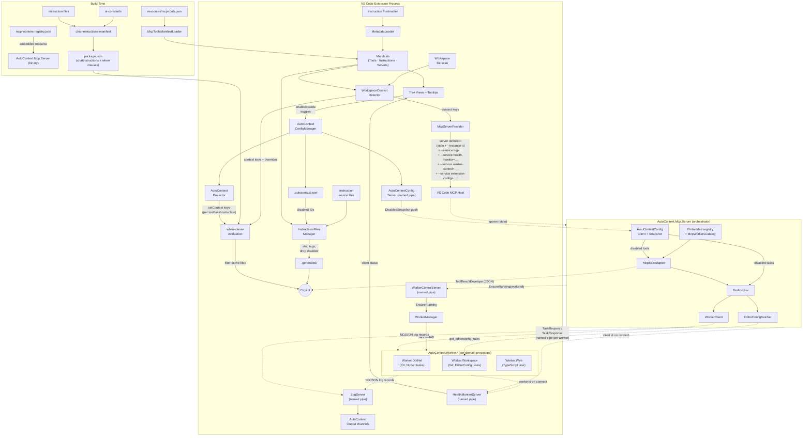

# Architecture

## What Is AutoContext?

AutoContext is a **context toolkit for AI coding assistants**. It ships with curated instructions that shape how code is written and reviewed, bundled MCP tools that validate code against concrete rules, and a context orchestration layer that automatically wires the right guidance and checks into the model based on the workspace and environment.

## Design Philosophy

### Why Instructions + Tools?

Instructions alone give guidance but can't verify compliance. Tools alone can flag violations but without context they produce generic advice. Combining both means Copilot receives coding guidelines (instructions) and can then verify its own output against those guidelines (tools) — a feedback loop that catches mistakes before they leave the chat.

### Why EditorConfig-Driven Enforcement?

Style rules vary between projects. Rather than hardcoding one opinion, checkers read `.editorconfig` properties and enforce whichever direction the project specifies. If a project uses tabs, the checker enforces tabs. If it uses spaces, it enforces spaces. Instructions provide sensible defaults, but EditorConfig always wins — so a team's existing configuration is never contradicted.

### Why an Orchestrator + Workers?

Copilot sees a single MCP server (`AutoContext.Mcp.Server`) that exposes every tool. Behind it, each tool is implemented as one or more **MCP Tasks** owned by a domain-specific worker process: `.NET` tasks live in `AutoContext.Worker.DotNet`, workspace tasks (Git, EditorConfig) live in `AutoContext.Worker.Workspace`, and TypeScript tasks live in `AutoContext.Worker.Web` (Node.js). The orchestrator embeds a registry that names every tool, its parameters, its tasks, and the worker that owns each task — and dispatches each call over a named pipe.

This buys three things: (1) a stable, consolidated MCP surface for the client even as workers come and go; (2) language affinity — `.NET` analyzers run in .NET, the TypeScript analyzer runs in Node.js; (3) cheap, parallel sub-task fan-out — every task in a tool runs concurrently against its worker.

### Why Per-Instruction Disable?

A single instruction file may contain dozens of rules. Turning off the entire file because one rule conflicts with a project convention defeats the purpose. Per-instruction disable (via `.autocontext.json`) removes individual bullets from the normalized output so Copilot never sees them — without affecting the rest of the file.

---

## How It All Connects

AutoContext spans **five OS processes** at runtime when running inside VS Code, fed by **two manifests**: an embedded **workers registry** that drives orchestrator dispatch, and an extension-side **MCP tools manifest** that drives sidebar UI. The diagram shows what produces what, how data flows between components, and which messages cross process boundaries.

The diagram reads top-to-bottom: **build artifacts** feed into the **extension process**, which spawns and configures every `AutoContext.Worker.*` process directly (`WorkerManager`) and registers the MCP definition that VS Code's MCP host uses to spawn `AutoContext.Mcp.Server`. Dotted lines cross process boundaries. Key connections to follow:

- **`AutoContext.Mcp.Server`** is the only MCP/stdio server Copilot ever talks to. At startup it deserializes its **embedded `mcp-workers-registry.json`** into `McpWorkersCatalog` (per-tool name, parameters, tasks, owning worker id) and registers every tool with the MCP SDK via `McpSdkAdapter`.
- **`ToolInvoker`** orchestrates one `tools/call`: it (a) consults the latest disabled-task set from `AutoContextConfigSnapshot` and short-circuits with `AllTasksDisabled` when every task for the tool is off, (b) computes the union of EditorConfig keys across the tool's *enabled* tasks, (c) batches a single `get_editorconfig_rules` pipe call to `Worker.Workspace` via `EditorConfigBatcher`, (d) dispatches the enabled tasks in parallel via `WorkerClient`, and (e) composes the per-task responses into a uniform `ToolResultEnvelope` via `ToolResultComposer`.
- **`WorkerClient`** opens one `NamedPipeClientStream` per task to `autocontext.worker-<id>#<instance-id>` (the per-window instance id keeps multiple VS Code windows isolated), writes a `TaskRequest`, and reads a `TaskResponse`. A 30-second wait deadline guards against hung workers; any IO/timeout/parse failure is mapped to a synthesized error response so partial results still flow back to Copilot.
- **`WorkerManager`** (extension-side) spawns workers **lazily** through a single `ensureRunning(identity)` gate. There are exactly two spawn triggers: (a) the orchestrator (`AutoContext.Mcp.Server`) sends an `EnsureRunning` request over the `autocontext.worker-control#<instance-id>` named pipe before dispatching a `tools/call` to a worker that owns the tool, and (b) `whenWorkspaceReady()` calls `ensureRunning('Worker.Workspace')` during extension activation so EditorConfig resolution is available. `ensureRunning` reads the worker definition from `resources/servers.json`, passes `--instance-id` plus `--service log=…` and `--service health-monitor=…` (the worker self-formats its listen address from its compile-time worker id + the instance id), coalesces concurrent callers onto a single in-flight promise, and waits for the worker's `[<WorkerName>] Ready.` stderr marker before returning.
- **Manifests** are the central UI hub — built from `resources/mcp-tools.json`, `resources/instructions-files.json`, `resources/servers.json`, and `MetadataLoader` output, they feed into the tree views, the workspace context detector, the server provider, and the instructions writer.
- **`WorkspaceContextDetector`** scans workspace files and sets context keys, which drive MCP server registration (`McpServerProvider`), instruction filtering (`when`-clause evaluation against `chatInstructions` in `package.json`), and tree views (detected state + override file versions for staleness comparison).
- **`.autocontext.json`** is the single source of truth for user configuration. `AutoContextConfigManager` is the only writer; it persists per-tool / per-task disabled state, per-instruction disable, per-rule disable lists (`disabledInstructions`), and a `version` stamp per entry. Two separate flows project the file's state to consumers: (1) `AutoContextProjector` translates it into `setContext` keys for VS Code (`autocontext.instructions.*`, `autocontext.mcpTools.*`) so tree icons and instruction `when` clauses react; (2) `AutoContextConfigServer` broadcasts a `disabledTools` / `disabledTasks` snapshot to `AutoContext.Mcp.Server` (see [Disabled-State Push Channel](#disabled-state-push-channel)). `McpServerProvider` still hides the MCP definition entirely when **every** tool is disabled — a fast path that skips spawning the orchestrator when the user has nothing left enabled.
- **`.generated/`** files are what Copilot actually reads — they are the instruction source files with `[INSTxxxx]` tags stripped and disabled rules removed. VS Code's `when`-clause engine evaluates the context keys to decide which `.generated/` files are active for a given workspace.
- **`HealthMonitorServer`** runs a named pipe (`autocontext.health-monitor#<instance-id>`) that every spawned process connects to on startup. The connecting process sends its stable id (`mcp-server` for the orchestrator, `dotnet`/`workspace`/`web` for the workers); the extension tracks active connections per id and exposes running/stopped status on tree view server nodes.
- **`LogServer`** runs a separate named pipe (`autocontext.log#<instance-id>`) that every spawned process connects to. Each connection emits a JSON greeting with its `clientName` (e.g. `AutoContext.Worker.DotNet`), then NDJSON log records carrying category, level, message, and an optional per-`tools/call` correlation id. Records are fanned out to per-worker `LogOutputChannel`s under the AutoContext Output panel.
- **`AutoContextConfigServer`** runs a fourth named pipe (`autocontext.extension-config#<instance-id>`) that pushes `.autocontext.json`'s disabled-state slice to subscribers (today only `AutoContext.Mcp.Server`). The orchestrator subscribes via `AutoContextConfigClient`, replaces its `AutoContextConfigSnapshot` on every frame, and emits an MCP `notifications/tools/list_changed` so VS Code's Quick Pick refreshes without restarting the server.

The [Activation Flow](#activation-flow) section below describes the exact ordering and parallelism of the startup steps. The [Runtime Flow](#runtime-flow) section describes what happens when Copilot calls a tool. The [Disabled-State Push Channel](#disabled-state-push-channel) section describes how UI toggles reach the orchestrator.

---

## Activation Flow

Extension activation (see `src/AutoContext.VsCode/src/extension.ts` and the modules it dispatches into) is split into **four explicit phases** so the construction step stays VS Code-free and easy to test, while async work is concentrated at the end:

### Phase 1 — Compose (`extension-composition.ts`)

`composeExtension()` builds the entire object graph in one synchronous, side-effect-free pass:

1. **Static manifests** — `MetadataLoader` parses YAML frontmatter from every instruction file (description, version, optional `applyTo`) and probes for a sibling `.CHANGELOG.md`. `McpToolsManifestLoader`, `InstructionsFilesManifestLoader`, and `ServersManifestLoader` build their respective manifests from `resources/mcp-tools.json`, `resources/instructions-files.json`, and `resources/servers.json`. The result feeds tree views, the writer, the projector, and the server provider.
2. **Core stateful services** — `AutoContextConfigManager`, `WorkspaceContextDetector`, `InstructionsFilesExporter`, `InstructionsFilesManager`, and `AutoContextProjector` are constructed (no I/O yet).
3. **Named-pipe servers** — a single 12-hex per-window `instanceId` is minted by `IdentifierFactory.createInstanceId()` and threaded into every server constructor: `LogServer`, `HealthMonitorServer`, `WorkerManager`, `WorkerControlServer`, and `AutoContextConfigServer`. The instance id keeps multiple VS Code windows fully isolated.
4. **VS Code-facing providers** — `InstructionsViewerDocumentProvider`, `InstructionsViewerCodeLensProvider`, `InstructionsViewerDecorationManager`, `McpServerProvider`, `InstructionsFilesTreeProvider`, `McpToolsTreeProvider`, and `InstructionsFilesDiagnosticsReporter`.

The phase returns a typed `ExtensionGraph` and a list of disposables for `context.subscriptions`. No `await`. No calls into `vscode.commands.*`.

### Phase 2 — Bootstrap (in `activate()`)

The minimum amount of async work needed before Phase 3 can register surfaces:

1. `await graph.configManager.read()` — pre-read `.autocontext.json` so tree providers render with real state on first query.
2. `graph.logServer.start()` — open the log pipe so subsequent processes have somewhere to connect.
3. `graph.healthMonitor.start()` — open the health pipe.
4. `graph.workerControlServer.start()` — open the worker-control pipe.
5. `graph.autoContextConfigServer.start()` — open the extension-config pipe so `AutoContext.Mcp.Server` can subscribe to `.autocontext.json` changes the moment it spawns.

No workers are spawned in this phase — they start lazily on first use (see [Worker Control](#worker-control)).

### Phase 3 — Register (`extension-registrations.ts`)

`registerExtensionSurfaces()` is pure registration — no `await`, no I/O. It registers the MCP server provider (`vscode.lm.registerMcpServerDefinitionProvider('AutoContextProvider', mcpServerProvider)`), every command (auto-configure, toggle/reset/enable/disable instructions, export mode, delete override, show original / changelog / what's new, show/hide not detected, start MCP server, show MCP server output), document and code-lens providers for the instruction viewer, and listeners that forward `configManager.onDidChange` to the MCP provider's change emitter and to the instructions writer.

The MCP provider is registered **before** workspace detection so tools appear in the picker immediately. The provider returns a `McpStdioServerDefinition` that points VS Code's MCP host at `AutoContext.Mcp.Server`'s binary with `--instance-id <id>` plus four repeatable `--service <role>=<address>` switches: `log`, `health-monitor`, `worker-control`, and `extension-config`. VS Code spawns the orchestrator over stdio when it queries the provider.

### Phase 4 — Activate (`extension-activation.ts`)

`runActivationSequence()` runs the async startup work in five sub-phases. Phases are sequential when there is a true ordering dependency, parallel within a phase otherwise.

- **Phase A — Workspace detection.** `WorkspaceContextDetector.detect()` scans the workspace for project files, `package.json` dependencies, and directory markers, sets the `setContext` keys (`hasDotNet`, `hasTypeScript`, …) the MCP provider keys off, and parses frontmatter from any `.github/instructions/*.instructions.md` overrides for staleness comparison (see [Override Staleness](#override-staleness)). Emits a single `didChangeEmitter.fire()` so VS Code re-queries the MCP provider with the now-known context keys.
- **Phase B — Worker.Workspace ready barrier.** `await workerManager.whenWorkspaceReady()` (with a 30-second soft timeout) gates downstream work on `Worker.Workspace` being up so EditorConfig resolution and any other workspace-scoped task is available immediately.
- **Phase C — Independent fan-out.** `Promise.all([projector.project(), instructionsWriter.removeOrphanedStagingDirs(), configManager.removeOrphanedIds()])` projects the current `.autocontext.json` to context keys, garbage-collects per-workspace staging dirs older than one hour that belong to other VS Code windows, and clears disabled-instruction IDs from `.autocontext.json` that no longer match any instruction in the current extension version.
- **Phase D — Stale disabled-id clearing.** `configManager.clearStaleDisabledIds(catalogVersions)` compares the MAJOR.MINOR version stored alongside each file's disabled instruction IDs in `.autocontext.json` against the current manifest version. If the file's version has advanced, all disabled IDs for that file are cleared and the user is notified. Patch-only bumps are ignored because they preserve rule IDs. See [Versioning Semantics](#versioning-semantics).
- **Phase E — First instructions write, version banner, diagnostics.** `instructionsWriter.write()` normalizes every instruction file into `instructions/.generated/`, stripping `[INSTxxxx]` tags and removing disabled rules. `applyVersionBanner()` compares the running version against `lastSeenVersion` in global state and sets a one-shot badge on the Instructions tree (`"New version available"`) plus the `HasWhatsNew` context key when a `CHANGELOG.md` ships. Finally, `diagnosticsReporter.report()` runs `InstructionsFilesDiagnosticsRunner` against every instruction file and logs warnings (e.g. missing `[INSTxxxx]` IDs) to the **AutoContext** Output channel.

Window focus changes and workspace-trust grants trigger an extra `instructionsWriter.write()` (registered as listeners in Phase 3) so normalized files stay current as the user moves between windows.

## Runtime Flow

When Copilot invokes an MCP tool (e.g. `analyze_csharp_code`):

1. **Reception (orchestrator).** VS Code's MCP host forwards the `tools/call` request over stdio to `AutoContext.Mcp.Server`. The MCP SDK invokes the registered handler, which lives in `McpSdkAdapter`. The adapter mints an 8-character correlation id and resolves the matching `McpToolDefinition` from `McpWorkersCatalog`.
2. **Disabled-task short-circuit.** `ToolInvoker.InvokeAsync()` consults `AutoContextConfigSnapshot` (kept current by `AutoContextConfigClient`) and filters out any tasks the user has disabled in the tree. If every task for the tool is disabled, the call returns immediately with an `AllTasksDisabled` error envelope so dispatch never touches a worker.
3. **EditorConfig batching.** `ToolInvoker` walks the *enabled* tasks, computes the union of EditorConfig keys declared by those tasks, and — if any keys are required — issues a single batched `get_editorconfig_rules` pipe call to `AutoContext.Worker.Workspace` via `EditorConfigBatcher`. The result is sliced per-task: each task receives only the keys it asked for.
4. **Parallel task dispatch.** For each enabled `McpTaskDefinition`, `ToolInvoker` calls `WorkerClient.InvokeAsync(role, request, ct)`. All tasks in the tool run **concurrently** via `Task.WhenAll(...)`. The role is `worker-<workerId>`, which `ServiceAddressOptions.Format` expands to `autocontext.worker-<workerId>#<instance-id>` (or the un-suffixed form when no instance id is configured — standalone runs / smoke tests); the request is a `TaskRequest` carrying the task name, the caller's input data, the EditorConfig slice for that task, and the correlation id.
5. **Worker execution.** The worker process — `Worker.DotNet`, `Worker.Workspace`, or `Worker.Web` — accepts the connection, deserializes the `TaskRequest`, looks up the matching `IMcpTask` implementation (registered as a singleton via `WorkerHostBuilderExtensions.ConfigureWorkerHost`), and runs it under a `CorrelationScope` so every log record carries the same correlation id. The worker writes back a `TaskResponse` with `status: "ok" | "error"`, an `output` payload, and an optional `error` string.
6. **Result composition.** `ToolResultComposer.Compose(toolName, entries, elapsedMs)` rolls every per-task `TaskResponse` into a uniform `ToolResultEnvelope` whose entries match the **declared** task order (not completion order). The status field summarizes the run: `ok` (all succeeded), `error` (all failed), or `partial` (mix). The envelope is serialized as JSON and returned to VS Code; VS Code forwards it to Copilot.

`WorkerClient` enforces a 30-second wait deadline and never throws for IO/timeout/parse failures. Any such failure becomes an `error`-status `TaskResponse` for that one task, so the rest of the tool's tasks still complete and Copilot sees a partial-but-actionable result.

---

## Disabled-State Push Channel

The sidebar tree-view checkboxes are the user's primary mechanism for turning specific MCP tools and tasks on or off. Their state must reach `AutoContext.Mcp.Server` quickly enough that the next `tools/list` no longer advertises a disabled tool and the next `tools/call` skips a disabled task — without ever restarting the orchestrator. The disabled-state push channel makes that possible.

- **Extension side — `AutoContextConfigServer`** (`src/autocontext-config-server.ts`) hosts `autocontext.extension-config#<instance-id>`. On each subscriber connection it pushes the current `disabledTools` / `disabledTasks` snapshot derived from `AutoContextConfig.getToolsDisabledSnapshot()`. On every `AutoContextConfigManager.onDidChange` it re-broadcasts the new snapshot to every live subscriber. Frames use the same 4-byte little-endian length prefix + UTF-8 JSON framing as `WorkerControlServer`, and snapshots are full and idempotent so reconnects are trivially safe.
- **Orchestrator side — `AutoContextConfigClient`** (`AutoContext.Mcp.Server/Config/`) is a hosted service registered when `--service extension-config=<address>` is supplied. It connects to the pipe (5-second connect timeout), reads frames via `WorkerProtocolChannel.ReadAsync`, deserialises each `AutoContextConfigSnapshotDto`, and calls `AutoContextConfigSnapshot.Update(...)` to atomically swap the in-memory state. When `Update` reports a real diff, the client resolves the `ModelContextProtocol.Server.McpServer` from DI and fires a `notifications/tools/list_changed` so VS Code's Quick Pick refreshes immediately.
- **`AutoContextConfigSnapshot`** is a singleton holding `ImmutableHashSet<string> DisabledTools` plus `ImmutableDictionary<string, ImmutableHashSet<string>> DisabledTasks`. Reads are lock-free (`Volatile.Read` of the (tools, tasks) record), writes swap the whole record under `Volatile.Write`. `McpSdkAdapter` filters disabled tool names out of `tools/list`; `ToolInvoker` filters disabled task names out of dispatch (and short-circuits with `AllTasksDisabled` when nothing remains).
- **Standalone fallback.** When the orchestrator is launched without `--service extension-config=...` (e.g. running `Mcp.Server` outside VS Code), the client never starts and the snapshot stays at its empty default — nothing is disabled, every tool surfaces, every task dispatches.

`McpServerProvider` retains its own fast path: when **every** tool is disabled, it returns no MCP definitions and the orchestrator is never spawned. Once at least one tool is enabled, the orchestrator runs continuously and the push channel handles per-tool / per-task changes without restarts.

---

## Health Monitoring

Each spawned process — the orchestrator and every worker — connects to the extension's `HealthMonitorServer` on startup via a named pipe (`autocontext.health-monitor#<instance-id>`). The protocol is intentionally minimal:

1. The extension creates a `net.createServer()` listening on the health pipe.
2. Each process connects and writes its **stable id** as the first and only data message:
   - `mcp-server` for `AutoContext.Mcp.Server` (declared as `Program.HealthClientId`).
   - `dotnet`, `workspace`, `web` for the workers (declared as `Program.WorkerId` in each).
3. The connection is kept alive for the lifetime of the process. When the process exits, the OS closes the socket and the extension detects disconnect.

The extension tracks active connections per id and exposes `isRunning(id)` (true if at least one socket is open for that id). The `McpToolsTreeProvider` maps that result onto each server node's status in the sidebar:

| Status | Shown When |
|--------|------------|
| **Running** | At least one client with the matching id is connected. |
| **Stopped** | No client with that id is connected. |

Inline actions on server nodes allow the user to **Start** the MCP server (when stopped) or **Show Output** for any server directly from the sidebar. These commands delegate to VS Code's built-in `workbench.mcp.startServer` and `workbench.mcp.showOutput` commands. Stop and Restart actions are intentionally not exposed: the MCP server's lifetime is owned by the VS Code MCP host, and worker lifetimes are owned by `WorkerManager` and gated by lazy spawn (see [Worker Control](#worker-control)).

On the .NET side, `HealthMonitorClient` lives in `AutoContext.Framework/Hosting` and is consumed by both the orchestrator and every worker (registered as a hosted service in each `Program.Main`). Connection failures are non-fatal — health monitoring is a best-effort diagnostic, not a prerequisite for tool operation. The orchestrator's liveness is observed exclusively through the health pipe; workers additionally emit a `Ready.` marker to stderr from inside `WorkerTaskDispatcherService` once the pipe server is accepting connections, and `WorkerManager` uses that marker for its `whenReady()` barrier (independent of the health pipe).

---

## Worker Control

Workers are spawned **lazily**. Neither extension activation nor MCP server startup eagerly launches `Worker.DotNet`, `Worker.Workspace`, or `Worker.Web`. Instead, two cooperating components ensure a worker process exists exactly when it is needed:

- **Extension side — `WorkerControlServer`** (`src/worker-control-server.ts`) hosts a per-window named pipe `autocontext.worker-control#<instance-id>`. It accepts a single request type, `EnsureRunning { workerId }`, looks up the worker definition in `resources/servers.json`, calls `WorkerManager.ensureRunning(identity)`, and replies once the worker's `Ready.` marker has been observed. Concurrent requests for the same worker are coalesced onto a single in-flight spawn promise, so a burst of `tools/call`s never starts more than one process per worker id.
- **Orchestrator side — `WorkerControlClient`** (`AutoContext.Mcp.Server/Workers/Control`) connects to that pipe at startup using the `--service worker-control=<address>` switch passed in by `McpServerProvider`. Before `ToolInvoker` dispatches any task to a worker, it calls `EnsureRunningAsync(workerId)`, which round-trips a JSON `EnsureRunning` request over the pipe with a bounded deadline. If the orchestrator is launched without a `worker-control` service address (e.g., standalone runs outside the extension), the client degrades to a no-op so tools still dispatch to whatever worker is reachable.

The single spawn entry point on the extension side is `WorkerManager.ensureRunning(identity: string): Promise<void>`. It has exactly two callers in production: the worker-control server (orchestrator-driven) and `WorkerManager.whenWorkspaceReady()` (activation-driven, for `Worker.Workspace`). There is no `WorkerManager.start()` and no eager startup loop. When a worker exits, `WorkerManager` clears the cached `readyPromise` so the next `ensureRunning(identity)` respawns it.

The lazy model means a worker whose tools are all disabled in `.autocontext.json` is never spawned: the orchestrator never invokes a tool that would route to it, the worker-control channel is never asked to start it, and its sidebar server node stays **stopped**.

---

## Incremental Workspace Detection

After the initial full scan (`detect()`), `WorkspaceContextDetector` uses three file-system watchers to maintain detection state incrementally:

- **Existence watcher** — watches for creation/deletion of source files by extension (e.g., `.ts`, `.cs`, `.razor`).
- **Content watcher** — watches project manifests (`package.json`, `*.csproj`, etc.) for content changes that may add or remove framework dependencies.
- **Override watcher** — watches `.github/instructions/*.instructions.md` for user overrides.

When a watcher fires, the detector performs a targeted re-scan with 500ms debouncing:

- Only re-globs flags affected by deletions.
- Only re-scans npm or .NET content when their manifests change.
- Re-uses cached base flags for unchanged categories.
- Falls back to a full `detect()` if no prior scan exists.

Window focus changes also trigger an `InstructionsFilesManager.write()` to ensure normalized instruction files are up to date when the user returns to a window.

---

## Precedence

When multiple sources disagree, the following precedence applies:

| Priority | Source | Role |
|----------|--------|------|
| 1 | `.editorconfig` | Drives enforcement direction — tasks enforce whatever EditorConfig says. Instruction defaults yield to EditorConfig values. |
| 2 | Instruction files | Provide default coding guidance. Style rules in instructions are fallback defaults, not absolutes. |
| 3 | `.autocontext.json` | Controls which tools and instructions are active. |
| 4 | Workspace context | Determines which servers, tools, and instructions are advertised at all. |

See the "EditorConfig wins" rule in `copilot.instructions.md` for the user-facing statement of this precedence.

### Resolved Per Tool Call

EditorConfig values are pulled fresh on every `tools/call` (one batched pipe round-trip per invocation), so changes to `.editorconfig` take effect immediately — no extension reload required. Each task in the registry declares the keys it consumes; `ToolInvoker` unions them, asks `Worker.Workspace` for resolved values, and slices the response per task. A task with no declared keys gets an empty slice and runs against its instruction-only defaults.

Tasks that consume EditorConfig keys today (declared in `mcp-workers-registry.json`):

| Task | EditorConfig Keys |
|------|-------------------|
| `analyze_csharp_coding_style` | `csharp_prefer_braces`, `dotnet_sort_system_directives_first`, `csharp_style_expression_bodied_methods`, `csharp_style_expression_bodied_properties` |
| `analyze_csharp_project_structure` | `csharp_style_namespace_declarations` |

---

## Instructions

AutoContext ships curated Markdown instruction files organized into categories — General, Languages, .NET, Web, and Tools. The full list is defined in `ui-constants.ts`. One always-on file (`copilot.instructions.md`) provides cross-cutting rules; the rest are toggleable.

Each instruction file carries YAML frontmatter with a `name` (including an optional `(vX.Y.Z)` version suffix), `description`, and optional `applyTo` glob. `MetadataLoader` extracts this frontmatter at activation time (see [Activation Flow](#activation-flow) Phase 1), and the metadata is surfaced as rich tooltips in the sidebar panel.

Instructions are **workspace-aware** — they are only injected into Copilot's context when the workspace contains their technology (e.g., .NET instructions require a `.csproj` or `.sln` file). The always-on `copilot.instructions.md` is the only file that is attached unconditionally.

### Toggling

The **Instructions** sidebar panel groups instructions by category and lets you enable or disable each one via inline actions. Toggling an instruction off writes the disabled state to `.autocontext.json`, and the activation flow excludes it from the normalized output.

### Per-Instruction Disable

Each instruction file can contain dozens of individual rules. Click an instruction in the sidebar panel to open it in a virtual document where every rule is visible. CodeLens actions on each rule let you disable or re-enable it without turning off the entire file. Disabled rules are dimmed, tagged `[DISABLED]`, and written to `.autocontext.json`. The normalization step strips them from Copilot's context entirely.

### Export

Enter export mode from the Instructions panel header icon, check the instructions you want to export, and confirm. Files are copied to `.github/instructions/` for team sharing via source control. Exported instructions appear as **overridden** in the panel — the workspace-level file takes precedence over the built-in version. Delete the exported file to revert to the built-in version.

### Override Staleness

When an overridden instruction exists in `.github/instructions/`, `WorkspaceContextDetector` parses its frontmatter during workspace detection and extracts the version number. The tree view compares this override version against the bundled catalog version using `SemVer.isGreaterThan()`:

- **Not outdated** — the override version is equal to or greater than the bundled version. The tree item shows `"overridden"` with a standard tooltip.
- **Outdated** — the bundled version is newer. The tree item shows `"overridden (outdated)"` with a tooltip explaining that a newer version is available. Deleting the override shows a modal warning that includes both version numbers and confirms the user wants to upgrade to the latest built-in version.

Instructions with no version in their frontmatter are treated as non-outdated — there is no version to compare.

Inline actions on overridden items include **Show Original** (opens the bundled version in a virtual document for side-by-side comparison) and, when a `.CHANGELOG.md` companion file exists, **Show Changelog** (opens the version history in Markdown preview).

### Normalization Pipeline

Copilot never reads the raw instruction files. Three directories form a write-through pipeline:

- **`instructions/`** — the authored source files. Each rule is tagged with an `[INSTxxxx]` identifier used for per-rule disable and CodeLens UI. These files are never served to Copilot directly.
- **`instructions/.workspaces/<hash>/`** — per-workspace staging. Each VS Code window writes its own normalized copy here, keyed by a SHA-256 hash of the workspace root path. Normalization strips `[INSTxxxx]` tags and removes disabled rules entirely. The staging layer exists because multiple VS Code windows share a single extension directory — without it, windows with different configurations would overwrite each other's output. Orphaned staging directories (from closed windows, older than one hour) are garbage-collected on activation.
- **`instructions/.generated/`** — the live output that Copilot's `chatInstructions` reads. After staging, files are promoted here with a content-comparison guard (`copyIfChanged`) so identical content is never rewritten. Each file has a `when` clause that combines the instruction's context key (projected from `.autocontext.json` by `AutoContextProjector`) and the workspace context key — Copilot only sees files relevant to the current workspace.

On activation (and on configuration or window-focus changes), `InstructionsFilesManager.write()` runs the full source → staging → promotion cycle. Content-comparison guards at both stages make re-runs essentially free when nothing changed.

> **Future:** The three-directory pipeline exists because VS Code's `chatInstructions` contribution point is static — it can only reference files on disk. If the `chatPromptFiles` proposed API graduates to stable, `registerInstructionsProvider()` could serve normalized instruction content in-memory, eliminating the staging and generated directories entirely. Each window would provide its own content dynamically with no multi-window file conflicts. See [docs/future/dynamic-editorconfig-instructions.md](future/dynamic-editorconfig-instructions.md) for the current status of that API.

---

## Upgrade Detection

AutoContext tracks version changes at two levels — the extension as a whole, and each individual instruction — so users are aware of new content without being interrupted.

### Extension Upgrade Badge

On activation, the extension compares its running version against `lastSeenVersion` stored in VS Code global state. When they differ (the extension was just updated), a numeric badge appears on the **Instructions** tree view with a `"New version available"` tooltip. The badge auto-dismisses the next time the user reveals the panel, at which point `lastSeenVersion` is updated to the current version. If the extension ships a `CHANGELOG.md`, the **Show What's New** command is available from the panel header menu, opening the release notes in Markdown preview.

### Stale Disabled-ID Clearing

When an instruction's MAJOR.MINOR version advances, its `[INSTxxxx]` IDs may no longer map to the same rules. On activation, `clearStaleDisabledIds()` compares the MAJOR.MINOR stored in `.autocontext.json` against each instruction's current catalog version. If the version has advanced, all disabled IDs for that file are removed and the user sees an information message naming the affected files. Patch-only bumps preserve disabled IDs because the rule set is unchanged. See [Versioning Semantics](#versioning-semantics) for the full version-level contract.

### Per-Instruction Changelogs

Instruction files can ship with a companion `.CHANGELOG.md` (e.g., `lang-csharp.CHANGELOG.md`). `MetadataLoader` checks for this file at activation and records `hasChangelog` on the catalog entry. When present, a **Show Changelog** inline action appears on the tree item, opening the version history in Markdown preview so users can see what changed between versions.

---

## Metadata & Manifests

AutoContext is driven by **two separate manifests**, each owned by a different process and serving a different purpose. Both must agree on tool/task names — the build copies and validates them in lockstep.

### `mcp-workers-registry.json` (orchestrator)

`src/AutoContext.Mcp.Server/mcp-workers-registry.json` is **embedded as a resource** in the orchestrator binary. At startup, `RegistryEmbeddedResource` reads it from the assembly, `RegistryLoader.Parse` deserializes it into `McpWorkersCatalog`, and `RegistrySchemeValidator` validates structure against `mcp-workers-registry.schema.json` (also embedded). Each entry declares a worker's `id` plus the tools it owns, each tool's input parameters (used by `InputSchemaBuilder` to build the JSON Schema advertised to the MCP client), and each tool's tasks (with optional `editorconfig` keys for the EditorConfig batcher).

This manifest is the **single source of truth for orchestrator dispatch** — no other file affects which tool calls go to which worker.

### `resources/mcp-tools.json` (extension UI)

`src/AutoContext.VsCode/resources/mcp-tools.json` is loaded by `McpToolsManifestLoader` on extension activation. It carries the same tool/task names plus extension-only UI metadata: category grouping (`.NET`, `Workspace`, `Web`, `C#`, `NuGet`, `TypeScript`, `Git`, `EditorConfig`), `activationFlags` (e.g. `hasDotNet`), per-tool descriptions surfaced in tree-view tooltips, and the `workerId` that maps a category to the spawned worker.

### Instruction Frontmatter

Each instruction file carries YAML frontmatter (`name`, `description`, optional `applyTo`). The version is embedded as a suffix in the `name` field — e.g., `name: "lang-csharp (v1.0.0)"`. `MetadataLoader` extracts it via `SemVer.fromParentheses()` and merges the result into `InstructionsFilesManifest`.

### Versioning Semantics

Both instructions and tools carry semver version strings. The version levels have specific meanings:

**Instructions:**

| Level | Meaning | Impact on disabled IDs |
|-------|---------|----------------------|
| Major | Complete replacement — rules renumbered, removed, or fundamentally changed. `[INSTxxxx]` IDs from the previous major are not comparable. | Clear all disabled IDs |
| Minor | Rule set changed — IDs added, removed, or reordered. An existing `[INSTxxxx]` may now point to a different rule. | Clear all disabled IDs |
| Patch | Wording refined — same rules, same IDs, same order. No behavioral change. | Keep disabled IDs as-is |

When an instruction's MAJOR.MINOR version advances beyond the version stored alongside the user's disabled IDs, those IDs are automatically cleared and the user is notified. Patch-only bumps silently update the stored version.

**Tools:**

| Level | Meaning |
|-------|---------|
| Major | Breaking — tools or tasks renamed, removed, or fundamentally changed |
| Minor | New tools or tasks added; existing surface unchanged |
| Patch | Bug fixes or refinements to existing tasks |

---

## MCP and Tools

AutoContext exposes a single MCP/stdio server, `AutoContext.Mcp.Server`, that fronts every tool. Each tool is one or more **MCP Tasks** owned by a single worker process; the orchestrator dispatches per-task pipe calls in parallel. Tool, task, category, and worker mappings are all defined in `mcp-workers-registry.json` (orchestrator-side) and `resources/mcp-tools.json` (extension-side UI).

Today's tool surface (one composite tool per category, plus tasks):

| Category | Tool | Owning Worker |
|----------|------|----------------|
| .NET / C# | `analyze_csharp_code` (7 tasks: async, coding-style, member-ordering, naming, nullable, project-structure, test-style) | `Worker.DotNet` |
| .NET / NuGet | `analyze_nuget_references` (1 task: hygiene) | `Worker.DotNet` |
| Workspace / Git | `analyze_git_commit_message` (2 tasks: format, content) | `Worker.Workspace` |
| Workspace / EditorConfig | `read_editorconfig` (1 task: `get_editorconfig_rules`) | `Worker.Workspace` |
| Web / TypeScript | `analyze_typescript_code` (1 task: coding-style) | `Worker.Web` |

### Projects

The .NET solution and one Node.js workspace make up the runtime side:

- **`AutoContext.Mcp.Abstractions`** — `IMcpTask` interface only. The contract every worker task implements; depended on by both the workers and (transitively) the orchestrator's registry.
- **`AutoContext.Framework`** — Cross-cutting framework primitives shared by every .NET process:
  - `Hosting/` — `HealthMonitorClient` (the hosted service that connects to the extension's HealthMonitorServer pipe and announces this process's stable id; a no-op when no `health-monitor` service address was supplied).
  - `Logging/` — `LoggingClient`, `PipeLoggerProvider`, `PipeLogger`, `JsonLogGreeting`/`JsonLogEntry`, `CorrelationScope` (the per-`tools/call` ambient correlation id).
  - `Workers/` — `WorkerProtocolChannel` (the pipe-framing helper used by both the orchestrator's `WorkerClient` and the workers' dispatcher), `WorkerHostOptions`, `WorkerTaskDispatcherService` (the worker-side hosted service that accepts pipe connections, routes each `TaskRequest` to the matching `IMcpTask`, and emits the worker's `Ready.` stderr marker once it's listening).
- **`AutoContext.Worker.Shared`** — `Hosting/WorkerHostBuilderExtensions.ConfigureWorkerHost(args, readyMarker, workerId, ...)`. The single helper every worker calls in `Program.Main` to parse `--instance-id` and the repeatable `--service <role>=<address>` switches, then wire logging (from `service log=…`), health monitoring (from `service health-monitor=…`), and the dispatcher pipe (self-formatted from the worker id + instance id via `ServiceAddressFormatter.Format`).
- **`AutoContext.Mcp.Server`** — The MCP/stdio orchestrator. One process, one binary, one tool surface:
  - `Registry/` — Embedded-resource loader, schema validator, strongly typed catalog (`McpWorkersCatalog`, `McpWorker`, `McpToolDefinition`, `McpTaskDefinition`, `McpToolParameter`), and `InputSchemaBuilder` (turns parameter declarations into the JSON Schema sent to the MCP client).
  - `Tools/` — `McpSdkAdapter` (the bridge to the official ModelContextProtocol SDK), `Invocation/` (`ToolDelegateFactory`, `ToolHandler`, `ToolInvoker`), and `Results/` (`ToolResultEnvelope`, `ToolResultEntry`, `ToolResultSummary`, `ToolResultError`, `ToolResultComposer`).
  - `Workers/` — `WorkerClient` (one pipe round-trip per task; 30 s deadline; never throws on IO/timeout/parse failure), `Protocol/` (`TaskRequest`, `TaskResponse`, `WorkerJsonOptions`), `Transport/` (`ServiceAddressOptions` — holds the per-window `InstanceId` and formats `autocontext.<role>#<instance-id>` addresses via `AutoContext.Framework.Workers.ServiceAddressFormatter`).
  - `EditorConfig/` — `EditorConfigBatcher` (one pipe call per `tools/call` to `Worker.Workspace`'s `get_editorconfig_rules` task; results are sliced per task).
- **`AutoContext.Worker.DotNet`** — .NET worker. Owns the `analyze_csharp_*` and `analyze_nuget_*` tasks (`Tasks/CSharp/` and `Tasks/NuGet/`). `Program.Main` registers each task as a singleton `IMcpTask` and starts `WorkerTaskDispatcherService`.
- **`AutoContext.Worker.Workspace`** — .NET worker. Owns the `analyze_git_*` and `get_editorconfig_rules` tasks (`Tasks/Git/`, `Tasks/EditorConfig/`). `Hosting/WorkerOptions.WorkspaceRoot` is the per-window workspace root passed via `--workspace-root` (currently reserved for future workspace-scoped tasks).
- **`AutoContext.Worker.Web`** — Node.js / TypeScript worker. Owns the `analyze_typescript_coding_style` task. Mirrors the .NET worker structure with TypeScript equivalents of `LoggingClient`, `HealthMonitorClient`, and the dispatcher loop.

### EditorConfig Resolution

`.editorconfig` resolution lives in **one place**: `AutoContext.Worker.Workspace`'s `GetEditorConfigRulesTask`. Two paths reach it:

| Caller | Path | Purpose |
|--------|------|---------|
| Copilot (directly) | `read_editorconfig` MCP tool → orchestrator → pipe → `GetEditorConfigRulesTask` | Lets the model ask "what `.editorconfig` rules apply to this file?" before generating code. |
| Orchestrator (internally) | `ToolInvoker` → `EditorConfigBatcher.ResolveAsync` → pipe → `GetEditorConfigRulesTask` | Runs once per `tools/call` to gather every key declared by the tool's tasks in one round-trip. |

There is no shared in-process resolver and no `IEditorConfigFilter` abstraction — the orchestrator treats EditorConfig as just another worker capability. This keeps `Worker.Workspace` as the single owner of EditorConfig parsing and section cascading, and means the same code paths serve both Copilot calls and internal batching.

### Viewing Tool Invocation Logs

Every `AutoContext.Worker.*` and `AutoContext.Mcp.Server` process connects to the extension-hosted `LogServer` over its dedicated named pipe, sending one greeting line followed by NDJSON log records. The extension routes records to per-process `LogOutputChannel`s under the **AutoContext** Output panel:

1. Open the **Output** panel (`Ctrl+Shift+U`).
2. Select **AutoContext: \<process name\>** from the dropdown — e.g. `AutoContext: AutoContext.Worker.DotNet`, `AutoContext: AutoContext.Mcp.Server`.

Every record carries a `category` (the .NET `ILogger` category), a `level` (`Trace`/`Debug`/`Information`/`Warning`/`Error`/`Critical`), a `message`, an optional `exception`, and — for records emitted inside a `tools/call` — a short `correlationId` minted by `McpSdkAdapter`. The same correlation id appears in records from the orchestrator and every worker that participated, so a single tool call is traceable end-to-end.

If the LogServer pipe is unavailable (e.g. running a worker standalone outside VS Code), `LoggingClient` falls back to writing each record to stderr; `WorkerManager`'s stderr line-handler still surfaces those lines, just under its own subcategory rather than a per-worker channel.

---

*This document provides an architectural overview. For build instructions and configuration, see the [README](../README.md).*
