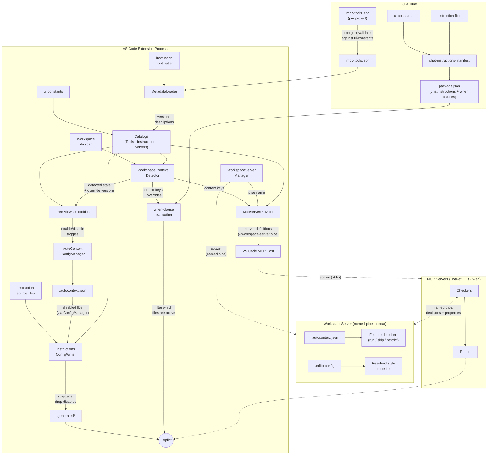

# Architecture

## What Is AutoContext?

AutoContext is a **context toolkit for AI coding assistants**. It ships with curated instructions that shape how code is written and reviewed, bundled MCP tools that validate code against concrete rules, and a context orchestration layer that automatically wires the right guidance and checks into the model based on the workspace and environment.

## Design Philosophy

### Why Instructions + Tools?

Instructions alone give guidance but can't verify compliance. Tools alone can flag violations but without context they produce generic advice. Combining both means Copilot receives coding guidelines (instructions) and can then verify its own output against those guidelines (tools) — a feedback loop that catches mistakes before they leave the chat.

### Why EditorConfig-Driven Enforcement?

Style rules vary between projects. Rather than hardcoding one opinion, checkers read `.editorconfig` properties and enforce whichever direction the project specifies. If a project uses tabs, the checker enforces tabs. If it uses spaces, it enforces spaces. Instructions provide sensible defaults, but EditorConfig always wins — so a team's existing configuration is never contradicted.

### Why a Separate Workspace Server?

Other MCP servers need `.editorconfig` properties and tool enable/disable decisions, but reparsing the directory tree and config file on every tool call would be wasteful and error-prone. `AutoContext.WorkspaceServer` centralizes these concerns in a single long-lived process so the checkers stay stateless. The same binary also hosts technology-agnostic MCP tools directly — see [Projects](#projects) for the full mode breakdown.

### Why Per-Instruction Disable?

A single instruction file may contain dozens of rules. Turning off the entire file because one rule conflicts with a project convention defeats the purpose. Per-instruction disable (via `.autocontext.json`) removes individual bullets from the normalized output so Copilot never sees them — without affecting the rest of the file.

---

## How It All Connects

AutoContext spans **three OS processes** at runtime, fed by **two build-time manifests**. The diagram shows what produces what, how data flows between components, and which files cross process boundaries.



The diagram reads top-to-bottom: **build artifacts** feed into the **extension process**, which spawns and configures the **WorkspaceServer sidecar** and **MCP servers**. Dotted lines cross process boundaries. Key connections to follow:

- **Catalogs** are the central hub — built from `ui-constants` + `MetadataLoader` output, they feed into tree views, the detector, and the server provider.
- **WorkspaceContextDetector** scans workspace files and sets context keys, which drive MCP server registration (`McpServerProvider`), instruction filtering (`when`-clause evaluation against `chatInstructions` in `package.json`), and tree views (detected state + override file versions for staleness comparison).
- **`.autocontext.json`** is the single source of truth for user configuration. `AutoContextConfigManager` reads and writes tool on/off toggles, disabled instruction IDs, and per-instruction disable lists. WorkspaceServer reads the same file for per-tool enable/disable decisions. MCP servers are separate OS processes — this file is how toggle state crosses the process boundary.
- **`.generated/`** files are what Copilot actually reads — they are the instruction source files with `[INSTxxxx]` tags stripped and disabled rules removed. VS Code's `when`-clause engine evaluates the context keys to decide which `.generated/` files are active for a given workspace.
- **MCP servers** connect to the WorkspaceServer sidecar over a named pipe to get feature decisions and resolved `.editorconfig` properties, then run their checkers and return reports to Copilot.

The [Activation Flow](#activation-flow) section below describes the exact ordering and parallelism of the startup steps. The [Runtime Flow](#runtime-flow) section describes what happens when Copilot calls a tool.

---

## Activation Flow

When the extension activates, the following steps execute:

**Phase 1 — Metadata & Catalogs** — `MetadataLoader` reads the merged `.mcp-tools.json` manifest (tool name, description, version) and parses YAML frontmatter from every instruction file (description, version). It also checks for a `.CHANGELOG.md` companion file for each instruction, recording `hasChangelog` so the tree view can offer a changelog command. The results are passed to `McpToolsCatalog`, `InstructionsCatalog`, and `McpServersCatalog`, which enrich the raw `ui-constants` data with metadata and serve as the single source of truth for all downstream consumers (tree views, tooltips, the instruction writer, and the server provider).

**Phase 2 — `WorkspaceServerManager.start()`** — spawns `AutoContext.WorkspaceServer` in named-pipe mode (see [Projects](#projects)). Each VS Code window gets its own pipe (`autocontext-workspace-<random>`) and its own server process, so multiple windows are fully isolated. The pipe name is injected into every MCP server definition via `--workspace-server`.

**Phase 3 (parallel)** — the following three operations run concurrently via `Promise.all()`:

- **`WorkspaceContextDetector.detect()`** — scans the workspace for project files, `package.json` dependencies, and directory markers. Sets VS Code context keys that control both server registration and instruction injection. Also scans `.github/instructions/` for override files, parsing their frontmatter to extract version numbers for staleness comparison (see [Override Staleness](#override-staleness)).
- **`InstructionsConfigWriter.removeOrphanedStagingDirs()`** — deletes per-workspace staging directories older than one hour that belong to other VS Code windows.
- **`ConfigManager.removeOrphanedIds()`** — cleans disabled-instruction IDs from `.autocontext.json` that no longer match any instruction in the current extension version.

**Phase 4 — `clearStaleDisabledIds()`** — compares the MAJOR.MINOR version stored alongside each file's disabled instruction IDs in `.autocontext.json` against the current catalog version. If the file's version has advanced (rules may have been renumbered or removed), all disabled IDs for that file are cleared and the user is notified. Patch-only bumps are ignored because they preserve rule IDs. See [Versioning Semantics](#versioning-semantics) for the version-level contract.

**Phase 5 — `InstructionsConfigWriter.write()`** — normalizes all instruction files into `instructions/.generated/`, stripping `[INSTxxxx]` tag identifiers and removing any individually disabled instruction bullets. Copilot always reads from the normalized output, so neither tags nor disabled content are visible to the model. Runs after phases 3–4 complete because it depends on workspace detection, config state, and stale-ID clearing.

**Phase 6 — Extension upgrade detection** — compares the running extension version against `lastSeenVersion` in global state. If the version differs, a badge is set on the Instructions tree view (`"New version available"`) that auto-dismisses when the user next reveals the panel. The `HasWhatsNew` context key is also set if the extension ships a `CHANGELOG.md`, enabling the "Show What's New" command.

**Phase 7 — `logDiagnostics()`** — parses every instruction file and logs warnings (e.g., missing `[INSTxxxx]` IDs) to the **AutoContext** Output channel.

## Runtime Flow

When Copilot invokes an MCP tool (e.g., `check_csharp_all`):

1. The `CompositeChecker` base class collects tool names from its sub-checkers and aggregates EditorConfig keys from any sub-checker that implements `IEditorConfigFilter`.
2. It sends a single `mcp-tools` request over the named pipe to `AutoContext.WorkspaceServer`, which reads `.autocontext.json` for tool status, resolves `.editorconfig` properties, and returns two flat, independent maps: `tools` (tool name → enabled/disabled) and `editorconfig` (key → value, filtered to the requested keys).
3. The composite checker merges explicit caller params with the resolved EditorConfig data into a single data bag. EditorConfig values (project rules) overwrite explicit params on conflict.
4. For each sub-checker the composite base decides how to run it:
   - **Enabled** — runs with the merged data bag.
   - **Disabled with EditorConfig keys** — runs in restricted mode (`__disabled` flag set), enforcing only EditorConfig-backed rules and skipping instruction-only (INST) checks. This lets project-level `.editorconfig` settings remain enforced even after a team opts out of the instruction.
   - **Disabled without EditorConfig keys** — skipped entirely.
5. The composite checker returns a combined report (✅ pass or ❌ violations found).

MCP servers never read `.autocontext.json` directly — all tool orchestration decisions are centralized in WorkspaceServer so the config format and decision logic can evolve in one place.

---

## Precedence

When multiple sources disagree, the following precedence applies:

| Priority | Source | Role |
|----------|--------|------|
| 1 | `.editorconfig` | Drives enforcement direction — checkers enforce whatever EditorConfig says. Instruction defaults yield to EditorConfig values. |
| 2 | Instruction files | Provide default coding guidance. Style rules in instructions are fallback defaults, not absolutes. |
| 3 | `.autocontext.json` | Controls which tools and instructions are active. |
| 4 | Workspace context | Determines which servers and instructions are registered at all. |

See the "EditorConfig wins" rule in `copilot.instructions.md` for the user-facing statement of this precedence.

### EditorConfig as a Floor

Disabling a tool removes its **instruction-only** checks from the report, but project-level `.editorconfig` settings are a stronger signal than a personal tool toggle. Checkers that implement `IEditorConfigFilter` declare which EditorConfig keys they consume. When a checker is disabled but the resolved `.editorconfig` contains at least one of those keys, the checker runs in a restricted mode that enforces only the EditorConfig-backed rules and skips the instruction-only (INST) checks.

This means a team can commit a `.editorconfig` that requires file-scoped namespaces or braces on single-line blocks, and those checks remain enforced even if an individual developer disables the corresponding tool. The `.editorconfig` acts as a floor that cannot be silenced by local tool toggles.

Checkers with EditorConfig backing today:

| Checker | EditorConfig Keys |
|---------|-------------------|
| `check_csharp_coding_style` | `csharp_prefer_braces`, `dotnet_sort_system_directives_first`, `csharp_style_expression_bodied_methods`, `csharp_style_expression_bodied_properties` |
| `check_csharp_project_structure` | `csharp_style_namespace_declarations` |

---

## Instructions

AutoContext ships curated Markdown instruction files organized into categories — General, Languages, .NET, Web, and Tools. The full list is defined in `ui-constants.ts`. One always-on file (`copilot.instructions.md`) provides cross-cutting rules; the rest are toggleable.

Each instruction file carries YAML frontmatter with a `name` (including an optional `(vX.Y.Z)` version suffix), `description`, and optional `applyTo` glob. `InstructionsParser` extracts this frontmatter at activation time (see [Activation Flow](#activation-flow) Phase 1), and the metadata is surfaced as rich tooltips in the sidebar panel.

Instructions are **workspace-aware** — they are only injected into Copilot's context when the workspace contains their technology (e.g., .NET instructions require a `.csproj` or `.sln` file). The always-on `copilot.instructions.md` is the only file that is attached unconditionally.

### Toggling

The **Instructions** sidebar panel groups instructions by category and lets you enable or disable each one via inline actions. Toggling an instruction off writes the disabled state to `.autocontext.json`, and the activation flow excludes it from the normalized output.

### Per-Instruction Disable

Each instruction file can contain dozens of individual rules. Click an instruction in the sidebar panel to open it in a virtual document where every rule is visible. CodeLens actions on each rule let you disable or re-enable it without turning off the entire file. Disabled rules are dimmed, tagged `[DISABLED]`, and written to `.autocontext.json`. The normalization step strips them from Copilot's context entirely.

### Export

Enter export mode from the Instructions panel header icon, check the instructions you want to export, and confirm. Files are copied to `.github/instructions/` for team sharing via source control. Exported instructions appear as **overridden** in the panel — the workspace-level file takes precedence over the built-in version. Delete the exported file to revert to the built-in version.

### Override Staleness

When an overridden instruction exists in `.github/instructions/`, `WorkspaceContextDetector` parses its frontmatter during workspace detection and extracts the version number. The tree view compares this override version against the bundled catalog version using `SemVer.isGreaterThan()`:

- **Not outdated** — the override version is equal to or greater than the bundled version. The tree item shows `"overridden"` with a standard tooltip.
- **Outdated** — the bundled version is newer. The tree item shows `"overridden (outdated)"` with a tooltip explaining that a newer version is available. Deleting the override shows a modal warning that includes both version numbers and confirms the user wants to upgrade to the latest built-in version.

Instructions with no version in their frontmatter are treated as non-outdated — there is no version to compare.

Inline actions on overridden items include **Show Original** (opens the bundled version in a virtual document for side-by-side comparison) and, when a `.CHANGELOG.md` companion file exists, **Show Changelog** (opens the version history in Markdown preview).

### Normalization Pipeline

Copilot never reads the raw instruction files. Three directories form a write-through pipeline:

- **`instructions/`** — the authored source files. Each rule is tagged with an `[INSTxxxx]` identifier used for per-rule disable and CodeLens UI. These files are never served to Copilot directly.
- **`instructions/.workspaces/<hash>/`** — per-workspace staging. Each VS Code window writes its own normalized copy here, keyed by a SHA-256 hash of the workspace root path. Normalization strips `[INSTxxxx]` tags and removes disabled rules entirely. The staging layer exists because multiple VS Code windows share a single extension directory — without it, windows with different configurations would overwrite each other's output. Orphaned staging directories (from closed windows, older than one hour) are garbage-collected on activation.
- **`instructions/.generated/`** — the live output that Copilot's `chatInstructions` reads. After staging, files are promoted here with a content-comparison guard (`copyIfChanged`) so identical content is never rewritten. Each file has a `when` clause that combines the instruction's context key (projected from `.autocontext.json` by `ConfigContextProjector`) and the workspace context key — Copilot only sees files relevant to the current workspace.

On activation (and on configuration or window-focus changes), `InstructionsConfigWriter.write()` runs the full source → staging → promotion cycle. Content-comparison guards at both stages make re-runs essentially free when nothing changed.

> **Future:** The three-directory pipeline exists because VS Code's `chatInstructions` contribution point is static — it can only reference files on disk. If the `chatPromptFiles` proposed API graduates to stable, `registerInstructionsProvider()` could serve normalized instruction content in-memory, eliminating the staging and generated directories entirely. Each window would provide its own content dynamically with no multi-window file conflicts. See [docs/future/dynamic-editorconfig-instructions.md](future/dynamic-editorconfig-instructions.md) for the current status of that API.

---

## Upgrade Detection

AutoContext tracks version changes at two levels — the extension as a whole, and each individual instruction — so users are aware of new content without being interrupted.

### Extension Upgrade Badge

On activation, the extension compares its running version against `lastSeenVersion` stored in VS Code global state. When they differ (the extension was just updated), a numeric badge appears on the **Instructions** tree view with a `"New version available"` tooltip. The badge auto-dismisses the next time the user reveals the panel, at which point `lastSeenVersion` is updated to the current version. If the extension ships a `CHANGELOG.md`, the **Show What's New** command is available from the panel header menu, opening the release notes in Markdown preview.

### Stale Disabled-ID Clearing

When an instruction's MAJOR.MINOR version advances, its `[INSTxxxx]` IDs may no longer map to the same rules. On activation (Phase 4), `clearStaleDisabledIds()` compares the MAJOR.MINOR stored in `.autocontext.json` against each instruction's current catalog version. If the version has advanced, all disabled IDs for that file are removed and the user sees an information message naming the affected files. Patch-only bumps preserve disabled IDs because the rule set is unchanged. See [Versioning Semantics](#versioning-semantics) for the full version-level contract.

### Per-Instruction Changelogs

Instruction files can ship with a companion `.CHANGELOG.md` (e.g., `lang-csharp.CHANGELOG.md`). `MetadataLoader` checks for this file at activation and records `hasChangelog` on the catalog entry. When present, a **Show Changelog** inline action appears on the tree item, opening the version history in Markdown preview so users can see what changed between versions.

---

## Metadata & Manifests

Tools and instructions carry version numbers and descriptions. This metadata flows from two sources into the extension at different times:

### Per-Project `.mcp-tools.json`

Each server project (`AutoContext.Mcp.DotNet`, `AutoContext.Mcp.Web`, `AutoContext.WorkspaceServer`) contains its own `.mcp-tools.json` declaring the tools it exposes. Each entry has a `name`, `description`, `version` (semver), and an optional `features` array for composite tools. During the build, `mcp-tools-manifest.ts` merges all per-project manifests into a single `.mcp-tools.json` at the extension root, validates that every leaf feature appears in `ui-constants.ts`, and checks that all versions are valid semver. Similarly, `chat-instructions-manifest.ts` builds the `chatInstructions` contribution in `package.json` from the instructions catalog.

### Instruction Frontmatter

Each instruction file carries YAML frontmatter (`name`, `description`, optional `applyTo`). The version is embedded as a suffix in the `name` field — e.g., `name: "lang-csharp (v1.0.0)"`. `InstructionsParser` extracts it via `SemVer.fromParentheses()`.

### MetadataLoader

At activation (Phase 1), `MetadataLoader` reads the merged `.mcp-tools.json` for tool metadata and parses frontmatter from every instruction file. It also probes for a `.CHANGELOG.md` companion file for each instruction and records `hasChangelog` on the metadata entry. The enriched data is passed to `McpToolsCatalog` and `InstructionsCatalog`, which serve as the single source of truth for tree views, tooltips, the instruction writer, and the MCP server provider.

### Versioning Semantics

Both instructions and tools carry semver version strings. The version levels have specific meanings:

**Instructions:**

| Level | Meaning | Impact on disabled IDs |
|-------|---------|----------------------|
| Major | Complete replacement — rules renumbered, removed, or fundamentally changed. `[INSTxxxx]` IDs from the previous major are not comparable. | Clear all disabled IDs |
| Minor | Rule set changed — IDs added, removed, or reordered. An existing `[INSTxxxx]` may now point to a different rule. | Clear all disabled IDs |
| Patch | Wording refined — same rules, same IDs, same order. No behavioral change. | Keep disabled IDs as-is |

When an instruction's MAJOR.MINOR version advances beyond the version stored alongside the user's disabled IDs, those IDs are automatically cleared and the user is notified. Patch-only bumps silently update the stored version.

**Tools:**

| Level | Meaning |
|-------|---------|
| Major | Breaking — features renamed, removed, or fundamentally changed |
| Minor | New features or checks added; existing features unchanged |
| Patch | Bug fixes or refinements to existing checks |

---

## MCP and Tools

AutoContext registers four MCP server scopes — `dotnet`, `git`, `editorconfig`, and `typescript` — each identified by a `--scope` argument. In the sidebar, tools are grouped by platform (`.NET`, `Workspace`, `Web`), then by category (`C#`, `NuGet`, `Git`, `EditorConfig`, `TypeScript`). Scopes, groups, and categories are all defined in `ui-constants.ts`. Servers are workspace-aware (see [Activation Flow](#activation-flow)) and most MCP tools loop over individually-toggleable features (see [Runtime Flow](#runtime-flow)).

### Projects

A shared class library and three executables make up the server side:

- **`AutoContext.Mcp.Shared`** — Shared contracts and communication layer for the .NET MCP servers. Contains:
  - `Checkers/` — `IChecker` and `IEditorConfigFilter` interfaces, and the `CompositeChecker` abstract base that orchestrates sub-checkers, resolves tool modes and EditorConfig data via a single pipe call, and collects the combined report.
  - `WorkspaceServer/` — `WorkspaceServerClient` (named-pipe client for querying WorkspaceServer) and a nested `McpTools/` subfolder containing the wire-contract types (`McpToolsRequest`, `McpToolsResponse`). The request carries tool names, an optional file path, and optional EditorConfig keys; the response returns two flat maps — tool enabled/disabled status and resolved EditorConfig properties. Both sides of the pipe share these types — they are the single source of truth.
- **`AutoContext.Mcp.DotNet`** — .NET-based MCP server. Handles the DotNet scope. Contains `Tools/CSharp/` (C# checkers) and `Tools/NuGet/` (NuGet hygiene). C# checkers resolve `.editorconfig` properties via the workspace server and use them to drive enforcement direction (e.g., brace style, namespace style).
- **`AutoContext.Mcp.Web`** — Node.js-based MCP server. Handles the TypeScript scope. Mirrors the .NET structure: `features/checkers/` (shared interfaces and `CompositeChecker` base), `features/logging/` (logger), `features/workspace-server/` (`WorkspaceServerClient` and nested `mcp-tools/` wire types), and `tools/typescript/` (checkers).
- **`AutoContext.WorkspaceServer`** — Handles cross-cutting workspace tasks and hosts technology-agnostic MCP tools. Multi-mode .NET executable with two folder layers:
  - `Tools/` — MCP-facing entry points (the tools Copilot calls). Contains `EditorConfig/EditorConfigTool` and `Git/` checkers.
  - `Hosting/` — Named-pipe server infrastructure and domain logic. At the top level: `WorkspaceService` (dispatch), `IRequestHandler`, and the `WorkspaceRequest` envelope. Subfolders contain feature handlers: `EditorConfig/` owns property resolution (`EditorConfigResolver`) and the named-pipe request handler; `McpTools/` owns tool orchestration (enable/disable decisions via `McpToolsConfig`, request handling via `McpToolsRequestHandler`).
  
  The dependency flows one way: Tools → Hosting. The three modes:
  - **MCP mode — EditorConfig** (`--scope editorconfig`): Runs as an MCP stdio server exposing a single standalone tool, `get_editorconfig`, which resolves the effective `.editorconfig` properties for a given file path by walking the directory tree, evaluating glob patterns and section cascading, and returning the final key-value pairs.
  - **MCP mode — Git** (`--scope git`): Runs as an MCP stdio server exposing Git quality checks (commit format, commit content).
  - **Named-pipe mode** (`--pipe <name>`): Runs as a long-lived background service started once by `WorkspaceServerManager`. Handles `"editorconfig"` requests (property resolution), `"mcp-tools"` requests (tool orchestration — enable/disable decisions + EditorConfig data), and `"log"` requests (centralized logging from MCP servers). All other MCP servers connect to this service via `--workspace-server <pipeName>`.

### EditorConfig Layering

EditorConfig logic appears at three levels, each with a distinct role:

| Layer | Location | Role |
|-------|----------|------|
| **Shared reader** | `Mcp.Shared/WorkspaceServer/WorkspaceServerClient` | Named pipe client. Sends requests to the WorkspaceServer and returns resolved properties + tool decisions to callers. Also routes log messages through the pipe for centralized output. Used by composite checkers in `Mcp.DotNet` and `WorkspaceServer`. The wire types (`McpToolsRequest`, `McpToolsResponse`, `LogRequest`) live in nested subfolders. |
| **Hosting resolver** | `WorkspaceServer/Hosting/EditorConfig/EditorConfigResolver` | Server-side logic. Walks the directory tree, parses `.editorconfig` files, evaluates glob patterns, and returns final key-value pairs. Owns the request handler for `"editorconfig"` pipe requests. |
| **MCP tool** | `WorkspaceServer/Tools/EditorConfig/EditorConfigTool` | The `get_editorconfig` MCP tool that Copilot can call directly. Delegates to the Hosting resolver. |

> **Future:** The current design relies on Copilot calling `get_editorconfig` explicitly — which depends on the model following the instruction in `copilot.instructions.md`. A planned improvement would replace this with a dynamic `InstructionsProvider` that injects `.editorconfig` rules into the chat context automatically, removing the tool-call dependency. This is blocked on the VS Code `chatPromptFiles` proposed API graduating to stable. See [docs/future/dynamic-editorconfig-instructions.md](future/dynamic-editorconfig-instructions.md) for details.

### Viewing Tool Invocation Logs

All MCP servers route tool invocation logs through the WorkspaceServer named pipe. The WorkspaceServer writes these to stderr, which the extension captures and forwards to the **AutoContext** Output channel. To view the logs:

1. Open the **Output** panel (`Ctrl+Shift+U`).
2. Select **AutoContext** from the dropdown.

Each log line is prefixed with the server identity (e.g., `[DotNet]`, `[Git]`, `[TypeScript]`), showing which composite tool was invoked, which sub-checkers ran, and which were skipped:

```
[DotNet] Tool invoked: check_csharp_all | content length: 1234
[DotNet]   Running: check_csharp_coding_style
[DotNet]   Running: check_csharp_naming_conventions
[DotNet]   Skipped: check_csharp_test_style
```

When the workspace server pipe is unavailable (e.g., running a server standalone outside VS Code), logs fall back to the server's local stderr with an explanation of why the pipe connection failed.

---

*This document provides an architectural overview. For build instructions and configuration, see the [README](../README.md).*
